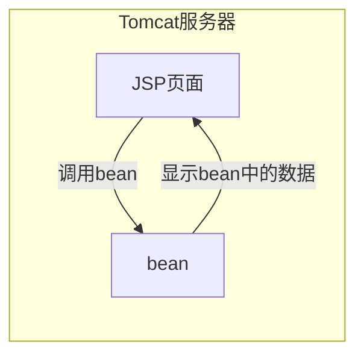
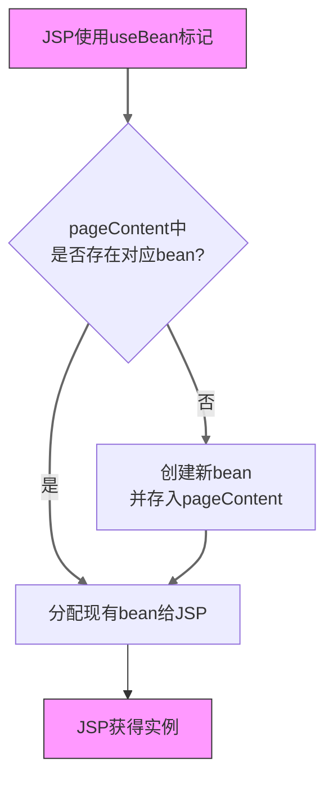
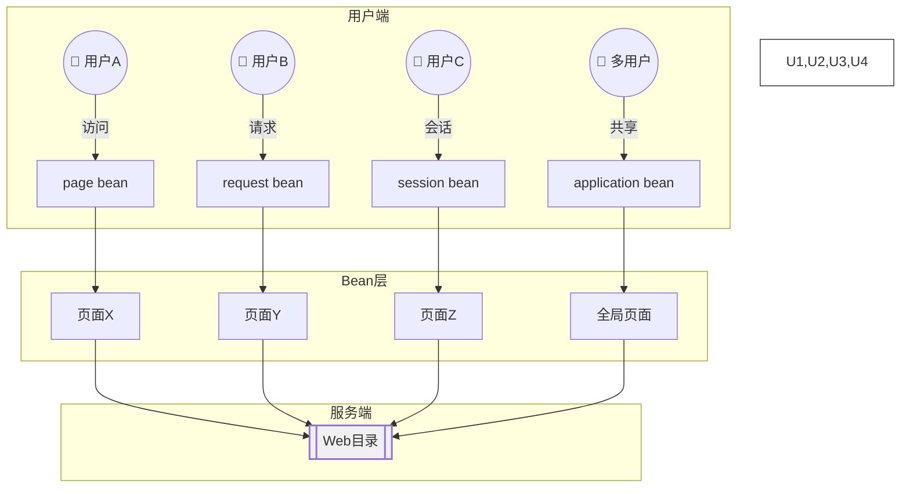
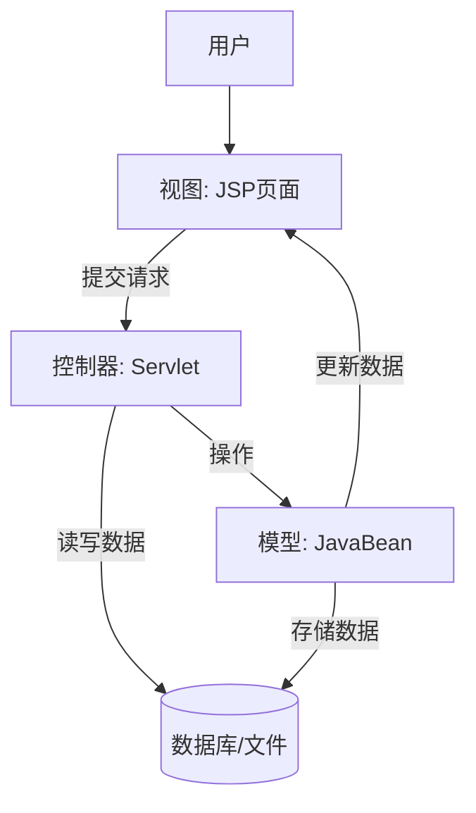

# 1.JSP概述  

## 1.1什么是JSP  
JSP(Java Server Pages)是一种动态网页开发技术，它是由Sun Microsystems公司倡导、许多公司参与一起建立的一种使软件开发者可以响应客户 
端请求，而动态生成HTML、XML或其他格式文档的技术标准。  

## 1.2JSP引擎与Tomcat服务器  
JSP引擎是一个Servlet，它是一个Java程序，用于解析JSP文件，编译JSP文件，生成Servlet文件，最后由Tomcat服务器执行Servlet文件。  
## 1.3JSP页面与Web服务目录  
JSP页面是一个包含有JSP标签的HTML文件，它的扩展名为.jsp。JSP页面通常存放在Web服务的根目录下的某个子目录中。  
## 1.4JSP运行原理  
当服务器上的一个JSP页面被第一次请求执行时，服务器上的 JSP引擎首先将JSP页面文件转译成一个java文件，并编译这个  
java文件生成字节码文件，然后执行字节码文件响应客户的请求。  
1. 把JSP页面中的HTML标记符号(页面的静态部分)交给客户的浏览器负责显示。  
2. 负责处理JSP标记，并将有关的处理结果发送到客户的浏览器。  
3. 执行“<%”和“%>”之间的java程序片(JSP页面中的动态部分，并把执行结果交给客户的浏览器显示。  
4. 当多个客户请求一个JSP页面时，Tomcat服务器为每个客户启 动一个线程，该线程负责执行常驻内存的字节码文件来响应相应客户的请求。  

---
# 2.JSP语法  
## 2.1JSP页面基本结构  
**JSP页面可由5种元素组合而成:**  
1. 普通的HTML标记符;  
2. JSP标记，如指令标记、动作标记;  
3. 变量和方法的声明:  
4. Java程序片:  
5. Java表达式  

**JSP页面的运行原理**  
* 把JSP页面中普通的HTML标记符号，交给客户的浏览器执行显示。  
* JSP标记、数据和方法声明、Java程序片由Tomcat服务器负责执行  
* 将需要显示的结果发送给客户的浏览器。  
* Java表达式由Tomcat服务器负责计算，将结果转化为字符串，交给客户的浏览器负责显示。  
  
## 2.2变量和方法的声明  
### 1. 变量声明  
- **语法**：使用 `<%! %>` 标签声明成员变量（实例变量）。  
- **作用域**：这些变量属于转换后的Servlet类的成员变量，生命周期与Servlet实例一致，多个请求共享（可能导致线程安全问题）。  
- **示例**：  
  ```jsp  
  <%!  
      private int count = 0; // 成员变量  
  	private static final String DEFAULT_NAME = "Guest"; // 静态常量  
  %>  
  ```
### 2. 方法声明  
- **语法**：同样使用 `<%! %>` 标签声明成员方法。  
- **作用域**：方法属于Servlet类的成员，可被同一JSP中的其他代码调用。但无法直接使用JSP内置对象（如 `request`、`response`）。  
- **示例**：  
  ```jsp  
  <%!  
      public String greet(String name) {          
      	return "Hello, " + name;      
  	}  
      // 同步方法处理线程安全  
      public synchronized void incrementCounter() {  
          count++;      
      }  
  %> 
  ```  
### 3. 局部变量  
- **语法**：在 `<% %>` 标签内声明的变量是局部变量。  
- **作用域**：仅在当前请求的 `service` 方法中有效，每个请求独立，线程安全。  
- **示例**：  
  ```jsp  
  <%  
      int localVar = 10; // 局部变量  
      String message = "This is a local variable.";  
  %>  ```  
### 4. 注意事项  
- **线程安全**：成员变量在多线程环境下可能引发竞态条件，需通过同步机制（如 `synchronized`）保护。  
- **内置对象限制**：在 `<%! %>` 中声明的方法无法直接使用 `request`、`response` 等内置对象，需通过参数传递。  
- **代码规范**：应避免在JSP中编写过多业务逻辑，保持关注点分离，推荐使用MVC模式。  
  
### 5. 示例整合  
```jsp  
<%!  
    private int visitCount = 0;  
    public synchronized void incrementVisitCount() {        
        visitCount++;    
    }
%>  
  
<%  
    incrementVisitCount(); // 调用方法  
%>  
  
<html>  
<body>  
    <h1>Welcome!</h1>    <p>Total visits: <%= visitCount %></p></body>  
</html>  
```

### 总结  
- **`<%! %>`**：声明成员变量和方法，需谨慎处理线程安全。  
- **`<% %>`**：用于局部变量和逻辑代码，线程安全。  
- **`<%= %>`**：输出表达式结果，不可包含语句。  
  
## 2.3Java程序片  
在<%和%>之间插入Java程序片:程序片中声明的变量称为JSP页面的局部变量，多个用户请求一个JSP页面时，Java程序片将被执行多次，分别在不同的线程中执行。  

## 2.4Java表达式  
在<%=和%>之间插入Java表达式:Java表达式的值将被转化为字符串，并插入到JSP页面的输出流中。  

## 2.5JSP中的注释  
1. HTML注释: <!--注释内容-->  
2. JSP注释: <%--注释内容--%>  
3. Java注释: //注释内容  
4. Java多行注释: /*注释内容*/  
5. JSP页面的注释: <!--HTML注释内容--><%--JSP注释内容--%>  

## 2.6JSP指令标记  

### **1. 指令标记基础**  
- **语法**：`<%@ 指令名 属性="值" %>`  
- **位置**：通常放在JSP文件顶部（但可出现在任意位置，在页面被请求前生效）  
- **作用范围**：影响整个JSP页面  
  
---

### **2. 主要指令类型**  

#### **(1) `page` 指令**  
控制与页面相关的全局属性。  

| 常用属性          | 说明                                                                 |  
|-------------------|---------------------------------------------------------------------|  
| `import`          | 导入Java类（唯一可多次使用的属性）                                   |  
| `contentType`     | 设置响应MIME类型和字符编码（默认`text/html;charset=ISO-8859-1`）    |  
| `errorPage`       | 指定错误处理页面路径                                                |  
| `isErrorPage`     | 声明当前页面是否为错误处理页（`true/false`）                        |  
| `session`         | 控制是否启用HTTP会话（默认`true`）                                  |  
| `buffer`          | 设置输出缓冲区大小（如`buffer="16kb"`）                             |  

**示例**：  
```jsp  
<%@ page import="java.util.Date, java.text.SimpleDateFormat" %>  
<%@ page contentType="text/html;charset=UTF-8" %>  
<%@ page errorPage="/error.jsp" %>  
```

---

#### **(2) `include` 指令**  
| **特性**     | `include` 指令标记 (`<%@ include file="..." %>`) | `include` 动作标记 (`<jsp:include page="..." />`) |      |
| ------------ | ------------------------------------------------ | ------------------------------------------------- | ---- |
| **语法**     | `<%@ include file="filePath" %>`                 | `<jsp:include page="filePath" />`                 |      |
| **执行时机** | 在 **编译时** 执行                               | 在 **运行时** 执行                                |      |
| **内容处理** | 包含的文件内容直接插入到当前 JSP 页面，一起编译  | 包含的文件单独编译执行，结果插入到当前页面        |      |
| **性能**     | 运行时性能较好（编译时处理）                     | 运行时性能开销较大（运行时处理）                  |      |
| **适用场景** | 适合包含 **静态内容**，且内容不经常变化          | 适合包含 **动态内容**，且内容可能经常变化         |      |
| **灵活性**   | 不够灵活，只能包含静态内容                       | 更灵活，可以包含动态内容，并支持传递参数          |      |
| **示例**     | `<%@ include file="header.jsp" %>`               | `<jsp:include page="header.jsp" />`               |      |


---

#### **(3) `taglib` 指令**  
引入JSP标签库（如JSTL或自定义标签）。  

| 属性      | 说明                     |  
|-----------|-------------------------|  
| `uri`     | 标签库的唯一标识符       |  
| `prefix`  | 标签前缀（命名空间）     |  

**示例**：  
```jsp  
<%@ taglib uri="http://java.sun.com/jsp/jstl/core" prefix="c" %>  
<!-- 使用JSTL核心标签 --><c:forEach items="${list}" var="item"> ... </c:forEach>  
```

---

### **3. 注意事项**  
1. **属性顺序无关**：属性书写顺序不影响功能。  
2. **重复指令处理**：  
  - `page` 指令的`import`属性可多次使用（其他属性重复时覆盖）。  
  - 其他指令的重复属性可能导致编译错误。  
3. **路径问题**：  
  - `include` 指令的路径是服务器端路径（相对于当前JSP文件）。  
4. **编码一致性**：  
  - `page` 指令的`contentType`字符集需与页面实际编码一致（如UTF-8）。  

---

### **4. 综合示例**  
```jsp  
<%@ page language="java" contentType="text/html; charset=UTF-8" %>  
<%@ page import="java.util.Date" %>  
<%@ include file="/WEB-INF/views/common/header.jsp" %>  
<%@ taglib prefix="fmt" uri="http://java.sun.com/jsp/jstl/fmt" %>  
  
<html>  
<head>  
    <title>订单详情</title>  
</head>  
<body>  
    <h1>订单时间：<fmt:formatDate value="<%= new Date() %>" pattern="yyyy-MM-dd"/></h1>  
    <%@ include file="footer.jsp" %></body>  
</html>  
```

---

### **5. 最佳实践**  
- **减少`<%! %>`声明**：避免在JSP中声明成员变量（线程安全问题）。  
- **优先使用JSTL/EL**：替代Java脚本，增强可读性（如用`<c:if>`替代`<% if(...) %>`）。  
- **错误处理规范**：  
  ```jsp  
  <%@ page errorPage="/error.jsp" %>A  
  <!-- error.jsp中需设置 -->  <%@ page isErrorPage="true" %>  ```  
---

### **总结**  
| 指令名     | 核心用途                              | 关键场景                     |  
|------------|-------------------------------------|----------------------------|  
| `page`     | 控制页面属性（编码、导入类、会话等） | 全局配置、错误处理           |  
| `include`  | 静态嵌入公共代码片段                 | 重用页头、页脚、导航栏       |  
| `taglib`   | 扩展JSP功能（如JSTL）               | 循环、格式化、数据库操作     |  

合理使用指令标记能提升JSP的可维护性和可读性，但需遵循MVC原则，将业务逻辑移至Servlet或Service层。  

---

# 3.Tag文件与Tag标记  
## 3.1 Tag文件  
### 3.1.1 Tag文件的结构  
Tag文件通常以`.tag`或`.tagx`为扩展名，包含JSP代码、HTML/XML内容以及标签声明。其结构包括：  • **Tag声明**：使用`<%@ tag %>`指令定义标签属性。  • **JSP代码**：包含脚本、表达式等逻辑。  • **HTML/XML内容**：定义标签的输出内容。  

### 3.1.2 Tag文件的保存  
Tag文件通常保存在`/WEB-INF/tags`目录下，以便JSP页面通过`tagdir`属性引用。  

---

## 3.2 Tag标记  
### 3.2.1 Tag标记与Tag文件  
Tag标记是JSP页面中调用Tag文件的语法，通过前缀和标签名引用Tag文件。  

### 3.2.2 Tag标记的使用  
在JSP页面中，使用`<%@ taglib %>`指令引入标签库，并通过`<prefix:tagname>`语法调用Tag文件。  

### 3.2.3 Tag标记的运行原理  
当JSP页面解析到Tag标记时，会查找对应的Tag文件，执行其中的逻辑，并将结果嵌入页面。  

---

## 3.3 Tag文件中的常用指令  
### 3.3.1 tag指令  
用于定义Tag文件的基本属性，如`language`和`pageEncoding`。  示例：  
```jsp  
<%@ tag language="java" pageEncoding="UTF-8" %>  
```

### 3.3.2 include指令  
用于在Tag文件中包含其他JSP或Tag文件。  示例：  
```jsp  
<%@ include file="header.jsp" %>  
```

### 3.3.3 attribute指令  
用于定义Tag文件的属性，支持`required`、`type`等参数。  示例：  
```jsp  
<%@ attribute name="username" required="true" type="java.lang.String" %>  
```

### 3.3.4 variable指令  
用于在Tag文件中定义变量，供JSP页面使用。  示例：  
```jsp  
<%@ variable name-given="result" scope="AT_END" %>  
```

### 3.3.5 taglib指令  
用于在Tag文件中引入其他标签库。  示例：  
```jsp  
<%@ taglib uri="http://java.sun.com/jsp/jstl/core" prefix="c" %>  
```

---

## 总结  
Tag文件和Tag标记是JSP中实现自定义标签的核心机制。通过Tag文件封装逻辑，通过Tag标记调用功能，可以显著提高代码的重用性和可维护性。常用指令如`tag`、`attribute`、`variable`等，进一步增强了Tag文件的灵活性和功能性。  

---
# 4.JSP内置对象
有些成员变量不用声明就可以在JSP页面的脚本（Java程序片和Java表达式）中使用，这就是所谓的内置对象。内置对象有：resquest、response、session、out 、 application

## 4.1request对象
### 4.1.1获取用户提交的信息
在JSP中，内置对象request封装了用户请求页面时所提交的信息，该对象调用相应的方法可以获取封装的信息.即**request对象**可以获取**用户提交的信息**。
用户在请求JSP页面时，通常会使用HTML表单提交信息，表单的一般格式是：
```jsp
<FORM  method=get|post action="提交信息的目的地页面">提交手段</FORM>

```


例如用户提交信息表单：
```jsp
<FORM action="tom.jsp" method=post >
	<INPUT type="text" name="boy" value="ok" >
	 <INPUT TYPE="submit" value="送出" name="submit">
</FORM> 
```

tom.jsp页面可以使用内置request对象获得用户提交的信息
```jsp
request.getParameter("boy");
```
---
这里简单说一下get请求和post请求
1. **GET请求**  
   • **用途**：主要用于从服务器**获取资源**（如查询数据、加载页面），属于**只读操作**，不会修改服务器状态。  
   • **数据传递**：参数附加在URL中，以`?key=value`形式拼接，多个参数用`&`连接，例如：  
     `http://example.com/search?keyword=go&page=1`。  
2. **POST请求**  
   • **用途**：用于向服务器**提交数据**（如注册、文件上传），属于**写操作**，可能改变服务器资源。  
   • **数据传递**：参数存储在**请求体**（Request Body）中，不可见，需通过工具（如开发者工具）查看。

| 特性         | GET请求               | POST请求           |
| ---------- | ------------------- | ---------------- |
| **数据位置**   | URL末尾（暴露可见）         | 请求体（隐藏）          |
| **数据大小限制** | 受URL长度限制（通常≤2048字符） | 理论无限制（受服务器配置影响）  |
| **安全性**    | 较低（易被日志、历史记录泄露）     | 较高（需结合HTTPS加密）   |
| **缓存机制**   | 可缓存（提升重复请求效率）       | 默认不可缓存（避免数据不一致）  |
| **幂等性**    | 幂等（多次请求结果相同）        | 非幂等（可能触发不同操作）    |
| **适用场景**   | 搜索、分页、获取静态资源        | 表单提交、文件上传、敏感信息传输 |

---

### 4.1.2处理汉字信息
当用request对象获取用户提交的汉字字符时,会出现乱码问题,所以对含有汉字字符的信息必须进行特殊的处理。首先,将获取的字符串用ISO-8859-1进行编码，并将编码存放到一个字节数组中，然后再将这个数组转化为字符串对象即可.如下所示：
```java
String str=request.getParameter("girl");
byte b[]=str.getBytes("ISO-8859-1");
str=new String(b);
```

### 4.1.3常用方法
| 方法名               | 描述                                                                 |
|----------------------|----------------------------------------------------------------------|
| getProtocol()        | 获取请求使用的通信协议，如http/1.1等。                                |
| getServletPath()     | 获取请求的JSP页面所在的目录。                                         |
| getContentLength()   | 获取HTTP请求的长度。                                                 |
| getMethod()          | 获取表单提交信息的方式，如POST或GET。                                 |
| getHeader(String s)  | 获取请求中头的值。                                                   |
| getHeaderNames()     | 获取头名字的一个枚举。                                               |
| getHeaders(String s) | 获取头的全部值的一个枚举。                                           |
| getRemoteAddr()      | 获取客户的IP地址。                                                   |
| getRemoteHost()      | 获取客户机的名称（如果获取不到，就获取IP地址）。                       |
| getServerName()      | 获取服务器的名称。                                                   |
| getServerPort()      | 获取服务器的端口号。                                                 |
| getParameterNames()  | 获取表单提交的信息体部分中name参数值的一个枚举。                       |
### 4.1.4使用Tag文件处理有关数据
JSP页面使用request对象获取用户提交的数据，然后使用Tag标记调用Tag文件，并将必要的数据传递给Tag文件。Tag文件负责处理数据，根据需要将处理结果显示给用户或返回给调用它的JSP页面。

### 4.1.5处理HTML标记
#### 4.1.5.1Form
FORM标记被习惯地称作表单，用户经常需要使用表单提交数据。表单的一般格式是：
```jsp
<FORM  method= get| post  action= "提交信息的目的地页面"  name="表单的名字">数据提交手段部分</FORM>
```

提交手段包括：通过文本框、列表、文本区等
#### 4.1.5.2input
表单标记Form将Input标记作为子标记来指定表单中数据的输入方式以及表单的提交键。Input标记中的type属性可以指定输入方式的GUI对象，name属性用来指定这个GUI对象的名称。Input标记的基本格式：
```jsp
   <Input type="输入对象的GUI类型" name="名字" >
```
 服务器通过属性name指定的名字来获取“输入对象的GUI类型”中提交的数据。“输入对象GUI类型”可以是：text（文本框）、checkbox（检查框）、submit（提交键）等。

#### 4.1.5.3Select和Option
下拉列表和滚动列表通过 `<Select>` 和 `<Option>` 标签来定义。基本格式如下：
1. 下拉列表
```html
<Select>
  <Option value="value1">选项1</Option>
  <Option value="value2">选项2</Option>
  <Option value="value3">选项3</Option>
</Select>
```
2. 滚动列表

在 `<Select>` 标签中添加 `size` 属性，指定可见行的数量，从而形成滚动列表。`size` 的值是滚动列表可见行的个数。

```html
<Select name="shulie" size=2>
  <Option value="cat">你选了小猫</Option>
  <Option value="1">计算1到n的连续和</Option>
  <Option value="dog">你选了小狗</Option>
  <Option value="2">计算1到n的平方和</Option>
  ...
</Select>
```

#### 4.1.5.4TextArea
TextArea 标记在表单中指定一个能输入多行文本的文本区域。
基本格式为：
```jsp
<TextArea  name= "ilovethisgame" Rows= "4" Cols= "20"></TextArea>
```

#### 4.1.6两大类表单
##### 4.1.6.1接受单个值
接受单个值的表单元素一次只能接收一个用户输入的值，像文本框、密码框、单选框等都属于此类。
```jsp
<!DOCTYPE html>  
<html>  
<head>  
    <title>Single Value Form</title>  
</head>  
<body>  
<form action="processSingleValue.jsp" method="post">  
    <label for="name">姓名:</label>  
    <input type="text" id="name" name="name"><br><br>  
    <label for="password">密码:</label>  
    <input type="password" id="password" name="password"><br><br>  
    <label>性别:</label>  
    <input type="radio" id="male" name="gender" value="男">  
    <label for="male">男</label>  
    <input type="radio" id="female" name="gender" value="女">  
    <label for="female">女</label><br><br>  
    <input type="submit" value="提交">  
</form>  
</body>  
</html>

```
##### 4.1.6.2接受多个值
接受多个值的表单元素允许用户一次输入多个值，常见的有复选框和下拉列表的多选模式。
```jsp
<!DOCTYPE html>  
<html>  
<head>  
    <title>Multiple Value Form</title>  
</head>  
<body>  
<form action="processMultipleValue.jsp" method="post">  
    <label>爱好:</label>  
    <input type="checkbox" id="reading" name="hobbies" value="阅读">  
    <label for="reading">阅读</label>  
    <input type="checkbox" id="sports" name="hobbies" value="运动">  
    <label for="sports">运动</label>  
    <input type="checkbox" id="music" name="hobbies" value="音乐">  
    <label for="music">音乐</label><br><br>  
    <label for="languages">擅长语言:</label>  
    <select id="languages" name="languages" multiple>  
        <option value="Java">Java</option>  
        <option value="Python">Python</option>  
        <option value="C++">C++</option>  
    </select><br><br>  
    <input type="submit" value="提交">  
</form>  
</body>  
</html><!DOCTYPE html>  
<html>  
<head>  
    <title>Multiple Value Form</title>  
</head>  
<body>  
<form action="processMultipleValue.jsp" method="post">  
    <label>爱好:</label>  
    <input type="checkbox" id="reading" name="hobbies" value="阅读">  
    <label for="reading">阅读</label>  
    <input type="checkbox" id="sports" name="hobbies" value="运动">  
    <label for="sports">运动</label>  
    <input type="checkbox" id="music" name="hobbies" value="音乐">  
    <label for="music">音乐</label><br><br>  
    <label for="languages">擅长语言:</label>  
    <select id="languages" name="languages" multiple>  
        <option value="Java">Java</option>  
        <option value="Python">Python</option>  
        <option value="C++">C++</option>  
    </select><br><br>  
    <input type="submit" value="提交">  
</form>  
</body>  
</html>
```
##### 4.1.6.3处理表单数据
**单个值使用getParameter 多个值使用request.getParameterValues**
## 4.2Response对象

### 4.2.1. 动态响应contentType属性

**原理与实现：**
response对象的setContentType()方法用于设置发送到客户端的响应的MIME类型和字符编码。这个方法必须在获取任何输出流之前调用，否则设置无效。

```jsp
<%@ page language="java" %>
<%
    // 设置响应内容类型为HTML，字符编码为UTF-8
    response.setContentType("text/html; charset=UTF-8");
    
    // 或者设置为其他MIME类型
    // response.setContentType("application/pdf");
    // response.setContentType("image/jpeg");
%>
```

**技术细节：**
• 该方法实际上设置的是HTTP响应头中的`Content-Type`字段
• 如果不设置，默认值为"text/html"，字符编码取决于page指令的contentType属性
• 必须在调用getWriter()或getOutputStream()之前调用，因为这些方法会提交响应头
• 可以包含字符编码信息，如"text/html;charset=UTF-8"

### 4.2.2. response的HTTP文件头

**原理与实现：**
response对象提供了多种方法来操作HTTP响应头：

```jsp
<%
    // 设置响应头
    response.setHeader("Cache-Control", "no-cache");
    
    // 添加响应头（可添加多个同名头）
    response.addHeader("Set-Cookie", "user=John");
    
    // 设置日期型头
    response.setDateHeader("Expires", System.currentTimeMillis() + 86400000);
    
    // 设置整型头
    response.setIntHeader("Content-Length", 1024);
%>
```

**技术细节：**
• HTTP响应头在服务器发送响应体之前发送给客户端
• 常用响应头包括：
  • Content-Type: 内容类型
  • Content-Length: 内容长度
  • Cache-Control: 缓存控制
  • Location: 重定向地址
  • Set-Cookie: 设置Cookie
• 头信息必须在任何内容写入响应之前设置
• 使用setHeader()会覆盖同名头，addHeader()会添加新头

### 4.2.3. response重定向

**原理与实现：**
response.sendRedirect()方法实现客户端重定向：

```jsp
<%
    // 简单重定向
    response.sendRedirect("newpage.jsp");
    
    // 带参数重定向
    response.sendRedirect("newpage.jsp?user=admin&status=1");
%>
```

**技术细节：**
• 工作原理：
  1. 服务器发送302状态码和Location头
  2. 客户端接收到响应后自动向新地址发起新请求
  3. 浏览器地址栏会显示新地址
• 与服务器端转发(forward)的区别：

    • 重定向是客户端行为，转发是服务器行为
    • 重定向会改变URL，转发不会
    • 重定向可以跳转到外部站点，转发只能在当前应用内
    • 重定向会丢失request范围内的属性，转发不会
• 必须在响应提交前调用，否则会抛出IllegalStateException

### 4.2.4. response的状态行

**原理与实现：**
response对象可以设置HTTP响应的状态码：

```jsp
<%
    // 设置状态码
    response.setStatus(HttpServletResponse.SC_OK); // 200
    
    // 常见状态码
    response.setStatus(HttpServletResponse.SC_NOT_FOUND); // 404
    response.setStatus(HttpServletResponse.SC_INTERNAL_SERVER_ERROR); // 500
    
    // 发送错误状态码和消息
    response.sendError(HttpServletResponse.SC_FORBIDDEN, "Access denied");
%>
```

**技术细节：**
• HTTP状态行包含：
  • 协议版本(如HTTP/1.1)
  • 状态码(如200)
  • 状态消息(如OK)
• 常见状态码：
  • 200 OK: 请求成功
  • 302 Found: 重定向
  • 404 Not Found: 资源不存在
  • 500 Internal Server Error: 服务器内部错误
• setStatus()仅设置状态码，sendError()会生成包含错误信息的完整错误页面
• 自定义错误页面可以在web.xml中配置

**底层机制：**
在JSP/Servlet容器中，response对象实际上是HttpServletResponse接口的实现。当容器接收到请求时，会创建一个response对象，该对象：
1. 初始化默认状态码为200
2. 提供缓冲区存储响应内容
3. 在提交响应时，将所有设置的头信息和状态码写入HTTP响应
4. 最后发送响应体内容

理解这些底层机制有助于更好地使用response对象控制Web应用的响应行为。

### 关于Request和Response对象

在Web开发中，Request和Response是两个核心概念：
#### Request对象（请求对象）
• 代表客户端向服务器发送的HTTP请求
• 包含请求的所有信息：
  • 请求方法（GET、POST等）
  • 请求头（headers）
  • 请求参数（URL参数或表单数据）
  • 请求体（对于POST/PUT请求）
  • 客户端信息（IP地址、用户代理等）

#### Response对象（响应对象）
• 代表服务器对客户端请求的回应
• 包含回应的所有信息：
  • 状态码（200、404、500等）
  • 响应头（headers）
  • 响应体（通常是HTML、JSON等数据）
  • 重定向信息
  • 缓存控制指令等

#### 工作流程
1. 客户端发送HTTP请求 → 创建Request对象
2. 服务器接收并处理Request
3. 服务器生成响应 → 创建Response对象
4. 服务器发送Response回客户端

在不同的Web框架中，这些对象的实现方式可能不同，但基本概念是一致的。例如在Django中是`HttpRequest`和`HttpResponse`，在Flask中是`request`和`make_response()`等。

---

## 4.3Session对象
HTTP协议是一种无状态协议。一个用户向服务器发出请求（request），然后服务器返回响应（response），连接就被关闭了，在服务器端不保留连接的有关信息，因此当下一次连接时，服务器已没有以前的连接信息了，无法判断这一次连接和以前的连接是否属于同一用户。内置**session(会话)对象**记录有关连接的信息,由Tomcat服务器负责创建。

### 4.3.1. Session对象的id

Session ID是服务器为每个用户会话分配的唯一标识符，用于区分不同用户的会话。

**技术原理：**
• 当用户第一次访问服务器时，服务器会创建一个唯一的Session ID（通常是一个128位的随机字符串）
• 这个ID通过Cookie（JSESSIONID）或URL重写的方式发送给客户端
• 客户端在后续请求中会携带这个ID，服务器据此识别用户会话
• Session ID的生成通常使用安全的随机数生成算法，确保唯一性和不可预测性

获取Session ID的方法：
```jsp
String sessionId = session.getId();
```

### 4.3.2. Session对象与URL重写

URL重写是当客户端禁用Cookie时维持会话的一种技术手段。

**技术原理：**
• 基本原理：将会话ID直接嵌入到URL中
• 服务器检查请求URL，如果包含会话ID参数，则使用该ID恢复会话
• 需要手动在所有链接中添加会话ID参数

实现方式：
```jsp
<a href="<%= response.encodeURL("page.jsp") %>">链接</a>
<!-- 或 -->
<a href="<%= response.encodeRedirectURL("page.jsp") %>">重定向链接</a>
```

**底层机制：**
• `encodeURL()`方法会检查客户端是否支持Cookie
• 如果不支持，自动在URL后追加";jsessionid=xxx"参数
• 服务器通过`HttpServletRequest`的`getRequestedSessionId()`方法获取URL中的Session ID

### 4.3.3. Session对象存储数据

Session对象可以存储用户会话期间需要保持的数据。

**技术原理：**
• Session数据存储在服务器内存中（或持久化到数据库/文件系统）
• 每个Session对象实际上是一个键值对集合
• 数据以对象形式存储，支持任何可序列化的Java对象

常用方法：
```jsp
<%-- 存储数据 --%>
<% session.setAttribute("user", userObject); %>

<%-- 获取数据 --%>
<% User user = (User)session.getAttribute("user"); %>

<%-- 移除数据 --%>
<% session.removeAttribute("user"); %>
```

**注意事项：**
• 存储大量数据会消耗服务器内存
• 集群环境下需要考虑Session复制或共享
• 对象需要实现Serializable接口以便必要时能序列化

### 4.3.4. 在Tag文件中使用session对象

在JSP自定义标签(Tag文件)中访问Session对象。

**技术原理：**
• Tag文件通过`jspContext`隐式对象访问Session
• `jspContext`是`PageContext`的实例，提供了访问所有JSP隐式对象的方法

实现方式：
```jsp
<%-- 在.tag文件中 --%>
<%@ attribute name="userId" required="true" %>
<%@ variable name-given="user" scope="AT_END" %>

<%
    // 通过jspContext获取session对象
    HttpSession tagSession = (HttpSession)jspContext.getAttribute("session", PageContext.SESSION_SCOPE);
    
    // 使用session
    User user = (User)tagSession.getAttribute("user_"+userId);
    jspContext.setAttribute("user", user);
%>
```

**最佳实践：**
• 尽量减少Tag文件对Session的直接操作
• 通过属性传递必要数据而非直接访问Session
• 保持Tag文件的独立性和可重用性

### 4.3.5. Session对象的生存期限

Session的生存期限指Session在服务器上保持活动的时间。

**技术原理：**
• 默认超时时间由Servlet容器配置（如Tomcat默认为30分钟）
• 计时从最后一次访问开始计算
• 超时后Session被销毁，所有存储的数据丢失

设置方法：
```jsp
<%-- 设置超时时间（分钟） --%>
<% session.setMaxInactiveInterval(60*60); // 1小时 %>

<%-- 获取当前超时设置 --%>
<% int timeout = session.getMaxInactiveInterval(); %>

<%-- 立即使Session失效 --%>
<% session.invalidate(); %>
```

**服务器配置：**
• 在web.xml中可以配置全局Session超时：
```xml
<session-config>
    <session-timeout>30</session-timeout> <!-- 分钟 -->
</session-config>
```

### 4.3.6. 使用session设置时间间隔

精确控制Session的时间行为。

**技术原理：**
• `setMaxInactiveInterval(int interval)`方法以秒为单位设置超时
• 设置为负数表示Session永不过期（不推荐）
• 设置为0表示立即过期

使用场景：
```jsp
<%
    // 根据不同用户类型设置不同超时
    if(user.isPremium()) {
        session.setMaxInactiveInterval(60*60*2); // 2小时
    } else {
        session.setMaxInactiveInterval(60*30); // 30分钟
    }
    
    // 保持Session活跃
    session.setAttribute("lastAccess", new Date());
%>
```

**注意事项：**
• 过长的超时时间会导致服务器资源浪费
• 过短的超时时间影响用户体验
• 重要操作应考虑重新验证身份而非单纯依赖Session超时

### 4.3.7. 计数器

使用Session实现页面访问计数器。

**技术原理：**
• 利用Session的生命周期特性统计用户会话期间的访问次数
• 每次访问递增存储在Session中的计数器值

实现代码：
```jsp
<%
    Integer count = (Integer)session.getAttribute("visitCount");
    if(count == null) {
        count = 1;
    } else {
        count++;
    }
    session.setAttribute("visitCount", count);
%>

<p>您在本会话中访问了 <%= count %> 次</p>
```

**高级应用：**
```jsp
<%-- 统计特定页面的访问 --%>
<%
    String pageName = "index.jsp";
    Map<String, Integer> pageCounts = (Map)session.getAttribute("pageCounts");
    if(pageCounts == null) {
        pageCounts = new HashMap<>();
        session.setAttribute("pageCounts", pageCounts);
    }
    Integer pc = pageCounts.get(pageName);
    pageCounts.put(pageName, (pc == null) ? 1 : pc+1);
%>
```

**注意事项：**
• 计数器数据仅存在于当前会话中
• 对于全局统计应考虑使用Application(ServletContext)对象
• 并发访问时考虑线程安全问题

## 4.4out对象
out对象是一个输出流,用来向用户端输出数据。out对象可调用如下的方法用于各种数据的输出：

| **方法**                 | **功能描述**      | **方法**                | **功能描述**            |
| ---------------------- | ------------- | --------------------- | ------------------- |
| `out.print(Boolean)`   | 输出一个布尔值       | `out.print(long)`     | 输出一个长整型数据           |
| `out.println(Boolean)` | 输出一个布尔值并换行    | `out.println(long)`   | 输出一个长整型数据并换行        |
| `out.print(char)`      | 输出一个字符        | `out.print(String)`   | 输出一个字符串对象的内容        |
| `out.println(char)`    | 输出一个字符并换行     | `out.println(String)` | 输出一个字符串对象的内容并换行     |
| `out.print(double)`    | 输出一个双精度浮点数    | `out.newLine()`       | 输出一个换行符（需结合其他方法使用）  |
| `out.println(double)`  | 输出一个双精度浮点数并换行 | `out.flush()`         | 强制输出缓冲区内容（图中未提及但常见） |
| `out.print(float)`     | 输出一个单精度浮点数    | `out.close()`         | 关闭输出流               |
| `out.println(float)`   | 输出一个单精度浮点数并换行 |                       |                     |


## 4.5application对象
在JSP中，`application` 对象是 **ServletContext** 的实例，代表整个Web应用程序的上下文环境。它的生命周期从服务器启动到服务器关闭（或应用被卸载），**所有用户共享同一个`application`对象**，因此适合存储全局数据。


### **JSP `application` 对象的核心特性**
| **特性**         | **说明**                                                                 |
|------------------|-------------------------------------------------------------------------|
| **作用域**       | 整个Web应用（所有用户和会话共享）                                        |
| **生命周期**     | 从服务器启动/应用加载开始，到服务器关闭/应用卸载结束                     |
| **存储位置**     | 服务器内存                                                              |
| **线程安全**     | **非线程安全**（需手动同步操作，如使用`synchronized`）                   |
| **典型用途**     | 全局配置、计数器、共享资源（如数据库连接池）                            |

### **常用方法**
| **方法**                          | **功能**                                                                 |
|-----------------------------------|-------------------------------------------------------------------------|
| `setAttribute(String name, Object value)` | 存储数据到`application`作用域（键值对形式）                             |
| `getAttribute(String name)`       | 根据键名获取数据（返回`Object`，需强制类型转换）                        |
| `removeAttribute(String name)`    | 移除指定键名的数据                                                     |
| `getAttributeNames()`             | 返回所有属性名的枚举（`Enumeration<String>`）                           |
| `getInitParameter(String name)`   | 获取`web.xml`中配置的全局初始化参数（如`<context-param>`）              |
| `getRealPath(String path)`        | 将虚拟路径转换为服务器文件系统的真实路径（如`/WEB-INF/config.xml`）     |


### **注意事项**
1. **线程安全问题**  
   • 多个用户可能同时修改`application`中的数据，需用`synchronized`同步：
     ```jsp
     <%
         synchronized(application) {
             Integer count = (Integer) application.getAttribute("counter");
             application.setAttribute("counter", count + 1);
         }
     %>
     ```

2. **与`session`的区别**  

| **对比项**         | **session对象**                                                                 | **application对象**                                                                 |
|---------------------|---------------------------------------------------------------------------------|-------------------------------------------------------------------------------------|
| **作用域**          | 用户会话级别（单个用户）                                                        | 应用全局级别（所有用户共享）                                                        |
| **生命周期**        | 从用户访问开始，到会话超时或手动销毁（如关闭浏览器或调用`invalidate()`）        | 从服务器启动到服务器关闭或应用卸载                                                  |
| **数据共享范围**    | 仅限同一用户的多次请求间共享                                                    | 所有用户和请求共享                                                                  |
| **JSP内置对象**     | `HttpSession`                                                                  | `ServletContext`                                                                   |
| **典型用途**        | 存储用户登录状态、购物车信息等个性化数据                                        | 存储全局配置、计数器、公共缓存等                                                    |
| **线程安全性**      | 线程安全（每个用户独立session）                                                 | 需手动处理线程安全（多线程共享）                                                    |
| **获取方式**        | `request.getSession()` 或直接使用JSP隐式对象`session`                          | `getServletContext()` 或直接使用JSP隐式对象`application`                            |
| **数据持久性**      | 会话结束后数据销毁                                                              | 服务器运行期间数据持续存在                                                          |
| **资源占用**        | 每个用户独立占用，可能消耗较多内存                                              | 全局唯一实例，内存占用相对固定                                                      |
| **示例代码**        | ```<% session.setAttribute", "Alice"); %>```                             | ```<% application.setAttribute("visits", 1000); %>```                               |


3. **避免滥用**  
   • 存储大量数据会导致服务器内存压力增大，建议仅用于必要的全局共享数据。
---
# 5.JSP与Java Bean
## 5.1编写和使用Java Bean
编写JavaBean就是编写一个Java的类，所以只要会写类就能编写一个JavaBean。这个类创建的一个对象称为一个JavaBean，简称bean，分配给bean的变量（成员变量），也称bean的属性。

### 一、编写Java Bean
为了能让使用bean的应用程序构建工具（比如Tomcat服务器）使用JSP动作标记知道bean的属性和方法，在类的命名上需要遵守以下规则：
（1）如果类的成员变量（也称bean的属性）的名字是xxx，那么为了获取或更改bean的属
性的值，类中必须提供两个方法：
>getXxxO，用来获取属性xxx。
>setXxxO，用来修改属性xxx。

（2）类中定义的方法的访问权限都必须是public的。
（3）类中必须有一个构造方法是public、无参数的。
```java
public class Circle {  
    private double radius;  
      
    public Circle(double radius) {  
        this.radius = radius;  
    }  
    public Circle() {}  
    public double getRadius() {  
        return radius;  
    }  
    public void setRadius(double radius) {  
        this.radius = radius;  
    }  
}
```

### 二、创建和使用Bean
①使用Bean
使用JSP动作标记useBean加载使用bean，语法格式是：
```jsp
<jsp:useBean id= "bean的名字" class = "创建 bean的类" scope = "bean有效范围"/>
```
或
```jsp
<jsp:useBean id= "bean的名字"class ="创建 bean的类"scope="bean有效范围">
</jsp:useBean>
```
②Bean的加载原理

③Bean的有效范围和声明周期

| **类型**               | **有效范围**        | **存活时间**             | **内存分配特点**                       | **用户间影响**        | **补充内容**                           |
| -------------------- | --------------- | -------------------- | -------------------------------- | ---------------- | ---------------------------------- |
| **page bean**        | 当前访问页面          | 页面执行完毕               | 每个JSP页面的bean独立分配                 | 不同用户互不影响         | Tomcat会在页面执行完毕后自动释放内存              |
| **session bean**     | 用户访问的Web目录下所有页面 | 会话期间（浏览器关闭/超时/服务器关闭） | 同一用户不同页面共享同一bean                 | 仅影响当前用户自身        | 会话消失条件：① 浏览器关闭 ② 超时（默认30分钟）③ 服务器关闭 |
| **request bean**     | 用户请求的当前页面       | 请求产生→服务器响应结束         | 每个请求独立分配，存活时间略长于page bean（含响应阶段） | 不同用户互不影响         | 适合转发场景（`<jsp:forward>`）            |
| **application bean** | 整个Web服务目录下所有页面  | 服务器运行期间              | 所有用户共享同一个bean                    | 任意用户的修改会影响其他所有用户 | 全局计数器典型场景，线程不安全，需自行处理同步问题          |

---
## 5.2获取和修改bean的属性
使用useBean动作标记获得一个bean后，在Java程序片或表达式中bean就可以调用方
法产生行为，这种情况下，不要求创建bean的类遵守setXxx和getXxx等规则。获取或修改bean的属性还可以使用JSP动作标记getProperty、setProperty，这种情况下，要求创建bean的类遵守setXxx和getXxx等规则，当JSP页面使用getProperty、setProperty标记获取或修改属性xxx时，必须保证bean有相应的getXxx和setXxx方法，即对方法名字的命名有特殊的要求。下面讲述怎样使用JSP的动作标记getProperty、setProperty去获取和修改 bean的属性。
### 一、getProperty
使用getProperty动作标记可以获得bean的属性值，并将这个值用串的形式
发送给用户的浏览器。使用getProperty动作标记之前，必须使用useBean动作标
记获得相应的 bean。
```jsp
<jsp:getProperty name = "bean的 id"property= "bean的属性" />
```
### 二、setProperty
使用setProperty动作标记可以设置bean的属性值。使用这个标记之前，必须使用useBean标记得到一个相应的 bean。

| **设置方式**                | **语法格式**                                                                 | **核心要求**                                                                 | **适用场景**                     | **注意事项**                                                                 |
|-----------------------------|-----------------------------------------------------------------------------|-----------------------------------------------------------------------------|---------------------------------|-----------------------------------------------------------------------------|
| **表达式/字符序列赋值**      | ```jsp<br><jsp:setProperty name="beanId" <br>property="属性名" <br>value="<%=表达式%>"/><br>``` 或<br>```jsp<br><jsp:setProperty name="beanId" <br>property="属性名" <br>value="字符序列"/><br>``` | 1. value类型必须与bean属性类型严格匹配<br>2. 表达式需用`<%= %>`包裹 | 需要动态计算值的场景<br>（如从数据库读取的数据） | 类型不匹配会导致转换异常                                                                 |
| **HTTP表单参数赋值**         |                                                                                                                                           |                                                                             |                                 |                                                                             |
| ① 匹配所有表单参数           | ```jsp<br><jsp:setProperty name="beanId" <br>property="*"/><br>```                                                                 | 1. 表单参数名必须与bean属性名完全一致<br>2. 自动执行String→属性类型转换 | 表单字段与bean属性一一对应时    | 参数名缺失会导致对应属性不被设置                                                          |
| ② 指定单个表单参数           | ```jsp<br><jsp:setProperty name="beanId" <br>property="属性名" <br>param="参数名"/><br>```                                               | 1. 仅转换指定参数<br>2. 支持参数名与属性名不同                          | 表单字段与bean属性非对称时      | 需显式声明param参数名                                                                   |
## 5.3Bean的辅助类
在写一个创建bean的类时，除了需要用import语句引人JDK提供的类，可能还需要自已编写一些其他的类，只要将这样类的包名和bean类的包名一致即可（也可以和创建bean的类写在一个Java源文件中）

---
# 6.Java Servlet基础
JSP的根基是JavaServlet技术，该技术的核心就是在Tomcat服务器端创建响应用户请求的对象，被创建的对象习惯上称为一个servlet。
## 6.1Servlet的部署、创建与运行
JavaServlet的核心思想是在Tomcat服务器端创建响应用户请求的servlet对象，简称
servlet。
### 一、源文件及字节码文件
**Servlet类**
写一个创建servlet的类就是编写一个特殊类的子类，这个特殊的类就是javax.servlet. http包中的HttpServlet类。HttpServlet实现了Servlet接口,实现了响应用户的方法。HttpServlet的子类被习惯地称作一个Servlet类，这样的类创建的对象习惯地被称作一个servlet。
```java
public class ServletDemo extends HttpServlet {  
    @Override  
    protected void service(HttpServletRequest req, HttpServletResponse resp) throws ServletException, IOException {  
        super.service(req, resp);  
    }  
}
```

### 二、编写部署文件web.xml
Servlet类的字节码文件保存到指定的目录后，必须为Tomcat服务器编写一个部署文件，只有这样，Tomcat服务器才会用Servlet类创建servlet对象。
```xml
<?xml version="1.0" encoding="UTF-8"?>
<web-app>
    <servlet>
        <servlet-name>hello</servlet-name>
        <servlet-class>moon.sun.Example6_1</servlet-class>
    </servlet>
    <servlet-mapping>
        <servlet-name>hello</servlet-name>
        <url-pattern>/lookHello</url-pattern>
    </servlet-mapping>
</web-app>
```

| **标记类型**               | **标签格式**                                   | **子标记要求**                                                                        | **功能说明**                                    | **注意事项**                                                                                          |
| ---------------------- | ------------------------------------------ | -------------------------------------------------------------------------------- | ------------------------------------------- | ------------------------------------------------------------------------------------------------- |
| **根标记**                | `<web-app> ... </web-app>`                 | 无（但包含其他子标记，如 `<servlet>` 和 `<servlet-mapping>`）                                  | 定义整个 `web.xml` 的根元素，所有配置必须包含在此标记内。          | 每个 `web.xml` 文件必须有且仅有一个 `<web-app>` 标记。                                                           |
| **servlet 标记**         | `<servlet> ... </servlet>`                 | **必须包含：**<br>1. `<servlet-name>`（唯一标识）<br>2. `<servlet-class>`（Servlet 类）        | 定义一个 Servlet 实例，告知 Tomcat 使用哪个类创建该 Servlet。 | 1. 多个 `<servlet>` 标记时，`<servlet-name>` 必须唯一。<br>2. 每个 `<servlet>` 对应至少一个 `<servlet-mapping>`。     |
| **servlet-mapping 标记** | `<servlet-mapping> ... </servlet-mapping>` | **必须包含：**<br>1. `<servlet-name>`（匹配 `<servlet>` 的名称）<br>2. `<url-pattern>`（访问路径） | 将 Servlet 映射到 URL，使客户端可通过指定路径访问该 Servlet。   | 1. 一个 `<servlet>` 可对应多个 `<servlet-mapping>`（多个访问路径）。<br>2. `<url-pattern>` 需符合规范（如 `/example/*`）。 |
### 三、向Servlet传递参数的值
在请求一个servlet时，可以在请求的url-pattern中额外加人参数及其值，格式是：
>url- pattern?参数1 =值＆参数2=值·参数n＝值

那么被请求的servlet就可以使用request对象获取参数的值，例如：
>request. getParameter(参数 n)

## 6.2Servlet工作原理
### 一、Servlet生命周期
一个servlet的生命周期主要由下列三个过程组成：
（1）初始化servlet。servlet第一次被请求加载时，服务器初始化这个servlet，即创建一个
servlet，这servlet调用init方法完成必要的初始化工作。
（2）新诞生的servlet再调用service方法响应用户的请求。
（3）当服务器关闭时，调用destroy方法销毁servlet。
init方法只被调用一次，即在servlet第一次被请求加载时调用该方法。当后续的用户请
求servlet服务时，Tomcat服务器将启动一个新的线程，在该线程中，servlet调用service方法响应用户的请求。也就是说，每个用户的每次请求都导致service方法被调用执行，其执行过程分别运行在不同的线程中。

### 二、init方法
>public void init(ServletConfig config) throws ServletException

servlet第一次被请求加载时，服务器创建一个servlet，这个对象调用init方法完成必要的初始化工作。该方法在执行时，服务器会把一个SevletConfig类型的对象传递给init方法，这个对象就被保存在servlet中，直到servlet被销毁。这个ServletConfig对象负责向servlet传递服务设置信息，如果传递失败就会发生ServeletException，servlet就不能正常工作。

### 三、service方法
>public void service(HttpServletRequest request HttpServletResponse response)throw ServletException,
IOException

当servlet成功创建和初始化之后，调用service方法来处理用户的请求并返回响应。
Tomcat服务器将两个参数传递给该方法。一个是HttpServletRequest类型的对象，该对象封装了用户的请求信息，另外一个参数对象是HttpServletResponse类型的对象，该对象用来响应用户的请求。

### 四、destory方法
>public destroy()

当Tomcat服务器终止服务时，例如关闭Tomcat服务器等，destroy方法会被执行，销
毁servlet。

## 6.3通过JSP页面访问Servlet
### 一、通过表单向Servlet提交数据
**基本流程**
1. 在JSP页面中创建HTML表单
2. 设置表单的`action`属性指向Servlet的URL
3. 设置表单的`method`属性为`get`或`post`
4. 用户在表单中输入数据并提交
5. Servlet接收并处理表单数据

```jsp
<%@ page contentType="text/html;charset=UTF-8" language="java" %>
<html>
<head>
    <title>用户注册</title>
</head>
<body>
    <form action="RegisterServlet" method="post">
        用户名: <input type="text" name="username"><br>
        密码: <input type="password" name="password"><br>
        性别: 
        <input type="radio" name="gender" value="male">男
        <input type="radio" name="gender" value="female">女<br>
        爱好:
        <input type="checkbox" name="hobby" value="reading">阅读
        <input type="checkbox" name="hobby" value="sports">运动<br>
        <input type="submit" value="注册">
    </form>
</body>
</html>
```

```java
@WebServlet("/RegisterServlet")
public class RegisterServlet extends HttpServlet {
    protected void doPost(HttpServletRequest request, HttpServletResponse response) 
            throws ServletException, IOException {
        
        // 获取单个值
        String username = request.getParameter("username");
        String password = request.getParameter("password");
        String gender = request.getParameter("gender");
        
        // 获取多个值(如复选框)
        String[] hobbies = request.getParameterValues("hobby");
        
        // 处理数据...
        
        // 响应客户端
        response.setContentType("text/html;charset=UTF-8");
        PrintWriter out = response.getWriter();
        out.println("<html><body>");
        out.println("<h2>注册成功</h2>");
        out.println("用户名: " + username + "<br>");
        out.println("性别: " + gender + "<br>");
        out.println("爱好: " + Arrays.toString(hobbies));
        out.println("</body></html>");
    }
}
```
### 二、通过超链接访问Servlet
除了表单提交，还可以通过超链接访问Servlet，通常用于传递简单参数或触发特定操作。
```jsp
<a href="ProductDetailServlet?id=1001">查看产品详情</a>
<a href="ProductDetailServlet?id=1002&category=electronics">电子产品详情</a>
```

```java
@WebServlet("/ProductDetailServlet")
public class ProductDetailServlet extends HttpServlet {
    protected void doGet(HttpServletRequest request, HttpServletResponse response) 
            throws ServletException, IOException {
        String productId = request.getParameter("id");
        String category = request.getParameter("category");
        
        // 根据参数查询产品详情...
    }
}
```

## 6.4共享变量
Servlet类是HttpServlet的一个子类，在编写子类时就可以声明某些成员变
量，那么，请求servlet的用户将共享该servlet的成员变量。
### 一、基本概念
Servlet共享变量是指在多个请求或Servlet之间共享数据的机制，主要包括三种作用域：

1. **请求作用域(Request)** - 单次请求内有效
2. **会话作用域(Session)** - 用户会话期间有效
3. **应用作用域(Application)** - 整个应用生命周期有效

### 二、三种作用域对比

| 作用域        | 实现类            | 生命周期               | 典型应用场景         |
|--------------|------------------|----------------------|-------------------|
| 请求(Request) | HttpServletRequest | 请求开始到响应结束      | 页面间传递数据       |
| 会话(Session) | HttpSession       | 用户会话期间(默认30分钟)| 用户登录状态、购物车  |
| 应用(Application) | ServletContext   | 应用启动到关闭         | 全局计数器、共享配置  |

### 三、基本使用示例

```java
// 1. 请求作用域
request.setAttribute("msg", "临时数据");  // 存数据
String msg = (String)request.getAttribute("msg");  // 取数据

// 2. 会话作用域
HttpSession session = request.getSession();
session.setAttribute("user", loginUser);  // 存用户对象
User user = (User)session.getAttribute("user");  // 取用户对象

// 3. 应用作用域
getServletContext().setAttribute("counter", globalCounter);  // 存全局计数器
Counter c = (Counter)getServletContext().getAttribute("counter");  // 取计数器
```

## 6.5doGet和doPost方法

### 一、doGet和doPost方法的基本概念

1. **核心功能**：
   • `doGet()`和`doPost()`是HttpServlet类中用于处理用户请求的核心方法
   • 分别对应HTTP协议的GET和POST请求方式

2. **调用机制**：
   • Tomcat服务器创建servlet后会调用`init()`方法初始化
   • 每个请求会创建新线程并调用`service()`方法
   • `service()`方法根据请求类型调用相应的`doGet()`或`doPost()`

### 二、实际应用示例分析


1. **JSP页面设置**：
   ```jsp
   <form action="sumORproduct" method=post>
     输入数字，用逗号分隔提交给servlet(post方式)：
     <input type=text name="number" />
   </form>
   
   <form action="sumORproduct" method=get>
     输入数字，用逗号分隔提交给servlet(get方式)：
     <input type=text name="number" />
   </form>
   ```

2. **Servlet处理逻辑**：
   • POST请求：计算数字的代数和
   • GET请求：计算数字的乘积

### 三、代码实现要点

1. **doPost方法示例**：
```java
public void doPost(HttpServletRequest request, HttpServletResponse response) {
    request.setCharacterEncoding("utf-8");
    response.setContentType("text/html;charset=utf-8");
    
    String s = request.getParameter("number");
    String[] a = s.split(",");
    double sum = 0;
    
    for(String item : a){
        if(item.length() >= 1)
            sum += Double.parseDouble(item);
    }
    
    // 输出结果
    out.println("<html><body bgcolor=cyan>");
    out.println("用户的请求方式是" + request.getMethod());
    out.println("的和是" + sum);
}
```

2. **doGet方法示例**：
```java
public void doGet(HttpServletRequest request, HttpServletResponse response) {
    request.setCharacterEncoding("utf-8");
    response.setContentType("text/html;charset=utf-8");
    
    String s = request.getParameter("number");
    String[] a = s.split(",");
    double product = 1;
    
    for(String item : a){
        if(item.length() >= 1)
            product *= Double.parseDouble(item);
    }
    
    // 输出结果
    out.println("<html><body bgcolor=yellow>");
    out.println("用户的请求方式是" + request.getMethod());
    out.println("的乘积是" + product);
}
```

### 四、部署配置

在web.xml中的配置：
```xml
<servlet>
    <servlet-name>sumORproduct</servlet-name>
    <servlet-class>moon.sun.Example6_Servlet</servlet-class>
</servlet>
<servlet-mapping>
    <servlet-name>sumORproduct</servlet-name>
    <url-pattern>/sumORproduct</url-pattern>
</servlet-mapping>
```

### 五、最佳实践建议

1. **编码规范**：
   • 始终设置请求和响应的字符编码(utf-8)
   • 明确设置响应内容类型

2. **方法选择**：
   • 处理表单提交优先使用doPost
   • 简单数据查询使用doGet

3. **线程安全**：
   • 避免在Servlet中使用实例变量
   • 使用局部变量处理请求数据

4. **错误处理**：
   • 添加对参数为空的判断
   • 处理数字解析可能抛出的异常
## 6.6重定向和转发

### 一、核心概念对比

| 特性                | 转发(forward)                          | 重定向(sendRedirect)                  |
|---------------------|---------------------------------------|---------------------------------------|
| **实现类**          | RequestDispatcher                     | HttpServletResponse                  |
| **方法调用**        | request.getRequestDispatcher().forward() | response.sendRedirect()              |
| **URL变化**         | 浏览器地址栏不变                      | 浏览器地址栏变化                     |
| **请求次数**        | 1次                                   | 2次                                  |
| **数据共享**        | 可共享request数据                     | 不能共享原始request数据              |
| **执行控制**        | 立即终止当前servlet执行               | 需执行完当前servlet代码(除非return)  |
| **应用场景**        | 控制器转发到视图                      | 跨应用跳转、登录后跳转               |

### 二、技术实现详解

1. 转发(forward)实现

```java
// 获取RequestDispatcher对象
RequestDispatcher dispatcher = request.getRequestDispatcher("target.jsp");

// 执行转发
dispatcher.forward(request, response);
```

**特点**：
• 转发后浏览器地址栏仍显示原始URL
• 刷新页面会重复提交到原始servlet
• 可传递request范围内的属性

2. 重定向(sendRedirect)实现

```java
// 绝对路径重定向
response.sendRedirect("/app/newPage.jsp");

// 相对路径重定向
response.sendRedirect("newPage.jsp");
```

**特点**：
• 实际产生两次请求(302响应+新请求)
• 浏览器地址栏显示新URL
• 无法保留原始request对象

### 三、实际应用案例解析

 1. 系统架构
```
example6_7.jsp → handleForward(Servlet) → sort/sum(Servlet)
```

2. 核心代码分析

**转发控制器(HandleForwardServlet)**：
```java
public void doPost(HttpServletRequest request, HttpServletResponse response) {
    String action = request.getParameter("submit");
    String data = request.getParameter("digitData");
    
    if(data == null || data.trim().isEmpty()) {
        response.sendRedirect("example6_7.jsp"); // 重定向回输入页
        return;
    }
    
    RequestDispatcher dispatcher = null;
    if(action.contains("sort")) {
        dispatcher = request.getRequestDispatcher("sort"); // 转发到排序
    } else if(action.contains("sum")) {
        dispatcher = request.getRequestDispatcher("sum");  // 转发到求和
    }
    
    if(dispatcher != null) {
        dispatcher.forward(request, response); // 执行转发
    }
}
```

**业务处理器(SumServlet)**：
```java
public void doPost(HttpServletRequest request, HttpServletResponse response) {
    String data = request.getParameter("digitData");
    // 解析并计算数字和
    // ...
    out.println("求和结果：" + sum);
}
```

### 四、设计优势与最佳实践

1. **解耦设计**：
   • JSP只负责展示
   • 控制器Servlet负责路由
   • 业务Servlet专注处理

2. **维护优势**：
   • 修改业务逻辑只需替换对应Servlet
   • 不影响其他组件
   • 方便扩展新功能

3. **使用建议**：
   • 优先使用转发保持数据连续性
   • 需要跨应用或防止重复提交时使用重定向
   • 敏感操作后必须使用重定向(如POST-REDIRECT-GET模式)

4. **注意事项**：
   • 转发前不要调用response.getWriter()
   • 重定向前不要提交响应
   • 合理选择相对/绝对路径

## 6.7使用Session
HTTP通信协议是用户与服务器之间一种请求与响应（request/response)的通信协议，属于无状态协议。所谓无状态是指，当用户（浏览器）发送请求给服务器，Tomcat服务器作出响应后，如果同一个用户再发送请求给Tomcat服务器时，Tomcat服务器并不知道就是刚才的那个用户。简单地说，Tomcat服务器不会记录用户的信息。
用户在访问一个Web服务目录期间，Tomcat服务器为该用户分配一个session对象（称为用户的会话），Tomcat服务器可以在各个页面以及servlet中使用这个session记录用户的有关信息，而且Tomcat服务器保证不同用户的session对象互不相同。有关session对象的原理、常用方法可参见4.3节。
HttpServletRequest对象request调用getSession方法获取用户的session对象：

>HttpSession session= request.getSession(true);

访问某个Web服务目录的用户，在不同的servlet中获取的session对象是完全相同的，
不同的用户的session对象互不相同。
# 7.MVC模式
模型-视图-控制器（Model-View-Controller)，简称为MVC。MVC已经成为软件设计者必须熟练使用的开发模式。本章必须理解、掌握在JSP程序设计中怎样具体体现MVC开发模式（其他语言的程序设计是非常类似的，仅仅是具体使用的API不同而已）。
## 7.1MVC模式介绍
MVC是一种通过三部分构造一个软件或组件的理想办法。
* 模型（model)：用于存储数据的对象。
* 视图（view）：向控制器提交所需数据、显示模型中的数据。
* 控制器（controller)：负责具体的业务逻辑操作，即控制器根据视图提出的要求对数据做出（商业）处理，将有关结果存储到模型中，并负责让模型和视图进行必要的交互，当模型中的数据变化时，让视图更新显示。
从面向对象的角度看，MVC开发模式可以使程序容易维护，也更容易扩展。在设计程序
时，可以将某个对象看作“模型”，然后为“模型”提供恰当的显示组件，即“视图”。在MVC模式中，“视图”“模型”和“控制器”之间是松耦合结构，便于系统的维护和扩展。

## 7.2JSP中的MVC模式
在JSP中，MVC模式具体实现如下：
* 模型（Model)：一个或多个JavaBean对象，用于存储数据。JavaBean主要提供简单的setXxx方法和getXxx方法，在这些方法中不涉及对数据的具体处理细节，以便增强模型的通用性。
* 视图（View）：一个或多个JSP页面，其作用是向控制器提交必要的数据和显示数据。JSP页面可以使用HTML标记、JavaBean标记以及Java程序片或Java表达式来显示数据。视图的主要工作就是显示数据，对数据的逻辑操作由控制器负责。
* 控制器（Controller)：一个或多个servlet对象，根据视图提交的要求进行数据处理操作，并将有关的结果存储到JavaBean中，然后servlet使用转发或重定向的方式请求视图中的某个JSP页面显示数据。例如让某个JSP页面通过使用JavaBean标记、Java程序片或Java表达式显示控制器存储在JavaBean中的数据。



## 7.3模型的生命周期与视图更新

### 一、MVC模式与JSP+JavaBean模式对比

1. 创建Bean的方式差异

| 模式 | 创建方式 | 特点 |
|------|----------|------|
| **JSP+JavaBean** | `<jsp:useBean id="名字" class="创建bean的类" scope="生命周期"/>` | 直接在JSP页面创建 |
| **MVC模式** | Servlet中通过构造方法创建 | 控制器集中管理 |

2. MVC模式优势
• 可使用带参数的构造方法
• 方法命名只需遵守getXxx规则（setXxx可不遵守）
• 更好的数据封装性（防止JSP直接修改数据）

### 二、Bean的三种作用域

1. Request Bean（请求作用域）
**生命周期**：单次请求期间有效

**创建步骤**：
```java
// 1. 创建Bean对象
BeanClass bean = new BeanClass();

// 2. 存入Request对象
request.setAttribute("keyword", bean);
```

**特点**：
• 存储在`PageContext.REQUEST_SCOPE`
• 转发到JSP后自动释放内存
• JSP获取方式：
```jsp
<jsp:useBean id="keyword" class="save.data.BeanClass" scope="request"/>
<jsp:getProperty name="keyword" property="属性名"/>
```

2. Session Bean（会话作用域）
**生命周期**：用户会话期间有效（默认30分钟不活动失效）

**创建步骤**：
```java
// 1. 创建Bean对象
BeanClass bean = new BeanClass();

// 2. 存入Session对象
HttpSession session = request.getSession(true);
session.setAttribute("keyword", bean);
```

**特点**：
• 存储在`PageContext.SESSION_SCOPE`
• 同一用户的所有JSP页面可共享
• 不同用户的session bean相互独立
• 可通过转发或重定向传递

 3. Application Bean（应用作用域）
**生命周期**：服务器运行期间有效

**创建步骤**：
```java
// 1. 创建Bean对象
BeanClass bean = new BeanClass();

// 2. 存入ServletContext
getServletContext().setAttribute("keyword", bean);
```

**特点**：
• 存储在`PageContext.APPLICATION_SCOPE`
• 所有用户共享同一个bean实例
• 服务器关闭后才会释放

### 三、视图更新机制


1. 转发与重定向选择

| 操作 | 方法 | 适用场景 |
|------|------|----------|
| **转发** | `RequestDispatcher.forward()` | 保持request bean有效 |
| **重定向** | `response.sendRedirect()` | 跨页面跳转时使用 |


2. 代码示例
```java
// 转发示例
RequestDispatcher dispatcher = request.getRequestDispatcher("show.jsp");
dispatcher.forward(request, response);

// 重定向示例
response.sendRedirect("result.jsp");
```

### 四、最佳实践建议

1. **作用域选择原则**：
   • 优先使用最小作用域（request > session > application）
   • 敏感数据避免使用application作用域

2. **线程安全考虑**：
   • application bean需要特别注意线程安全
   • 推荐使用同步机制或不可变对象

3. **性能优化**：
   • 及时清理不再使用的session bean
   • 大数据对象避免长期存储在session中

4. **MVC模式实现**：
   ```mermaid
   graph LR
       A[用户请求] --> B[控制器Servlet]
       B --> C[创建/获取Bean]
       C --> D[业务处理]
       D --> E[设置作用域]
       E --> F[转发到JSP]
       F --> G[JSP显示数据]
   ```

通过合理使用这三种作用域的Bean，可以构建出结构清晰、易于维护的Java Web应用程序。MVC模式的引入使业务逻辑、数据展示和控制流程得到了更好的分离，提高了代码的可重用性和可测试性。
# 8.JSP中使用数据库

## 8.1. MySQL数据库管理

#### 1.1 安装与启动
• **下载**：从[MySQL官网](https://www.mysql.com/)下载社区版（Community Edition）。
• **安装**：解压至本地目录（如 `D:\mysql-5.6.16-win32`）。
• **启动服务**：
  ```bash
  cd D:\mysql-5.6.16-win32\bin
  mysqld  # 或 mysqld -nt 启动服务
  ```

#### 1.2 数据库与表操作
• **创建数据库**：
  ```sql
  CREATE DATABASE Book CHARACTER SET gb2312;
  USE Book;
  ```
• **建表**：
  ```sql
  CREATE TABLE bookList (
    ISBN VARCHAR(100) PRIMARY KEY,
    name VARCHAR(100) CHARACTER SET gb2312,
    price FLOAT
  );
  ```
• **导入SQL文件**：
  ```sql
  SOURCE d:/1000/group.sql;
  ```

---

## 8.2. JDBC核心操作

#### 2.1 驱动加载与连接
• **加载MySQL驱动**：
  ```java
  Class.forName("com.mysql.jdbc.Driver");
  ```
• **建立连接**：
  • **方式1**（推荐避免乱码）：
    ```java
    String uri = "jdbc:mysql://localhost:3306/warehouse?user=root&password=99&characterEncoding=gb2312";
    Connection con = DriverManager.getConnection(uri);
    ```
  • **方式2**：
    ```java
    String uri = "jdbc:mysql://localhost:3306/warehouse";
    Connection con = DriverManager.getConnection(uri, "root", "99");
    ```

#### 2.2 中文乱码解决方案
• **数据库编码**：创建时指定字符集（`CHARACTER SET gb2312`）。
• **连接参数**：添加`characterEncoding=gb2312`。
• **字段编码**：建表时指定字段编码：
  ```sql
  name VARCHAR(100) CHARACTER SET gb2312
  ```

---

## 8.3. 数据操作（CRUD）

#### 3.1 查询记录
• **基本查询**：
  ```java
  Statement stmt = con.createStatement();
  ResultSet rs = stmt.executeQuery("SELECT * FROM product");
  while (rs.next()) {
    String name = rs.getString("name");
    // 处理结果
  }
  ```
• **条件查询**：
  ```java
  PreparedStatement pstmt = con.prepareStatement("SELECT * FROM product WHERE price < ?");
  pstmt.setDouble(1, 5000);
  ResultSet rs = pstmt.executeQuery();
  ```
• **排序与模糊查询**：
  ```sql
  SELECT * FROM product ORDER BY price DESC;
  SELECT * FROM product WHERE name LIKE '%戴%';
  ```

#### 3.2 更新记录
```java
String sql = "UPDATE product SET price=6866 WHERE name='海尔电视机'";
Statement stmt = con.createStatement();
int count = stmt.executeUpdate(sql);
```

#### 3.3 插入与删除
• **插入**：
  ```java
  String sql = "INSERT INTO product VALUES ('c002', 'IBM iPad', 5356, '2023-01-01')";
  stmt.executeUpdate(sql);
  ```
• **删除**：
  ```java
  String sql = "DELETE FROM product WHERE number='888'";
  stmt.executeUpdate(sql);
  ```

---

## 8.4. 高级功能

#### 4.1 结果集操作
• **可滚动结果集**：
  ```java
  Statement stmt = con.createStatement(ResultSet.TYPE_SCROLL_INSENSITIVE, ResultSet.CONCUR_UPDATABLE);
  ResultSet rs = stmt.executeQuery("SELECT * FROM product");
  rs.absolute(3);          // 移动到第3行
  rs.updateString("name", "IBM PC");
  rs.updateRow();          // 提交修改
  ```
• **插入行**：
  ```java
  rs.moveToInsertRow();
  rs.updateString(1, "c003");
  rs.insertRow();
  ```

#### 4.2 预处理语句（PreparedStatement）
• **优势**：预编译提升效率，防止SQL注入。
• **示例**：
  ```java
  PreparedStatement pstmt = con.prepareStatement("INSERT INTO product VALUES (?, ?, ?, ?)");
  pstmt.setString(1, "c004");
  pstmt.setString(2, "华为手机");
  pstmt.setDouble(3, 3999);
  pstmt.setDate(4, new Date(System.currentTimeMillis()));
  pstmt.executeUpdate();
  ```

#### 4.3 事务处理
• **ACID属性**：原子性、一致性、隔离性、持久性。
• **JDBC事务控制**：
  ```java
  con.setAutoCommit(false); // 关闭自动提交
  try {
    // 执行多个操作
    con.commit();           // 提交事务
  } catch (SQLException e) {
    con.rollback();         // 回滚事务
  }
  ```

---

## 8.5. 最佳实践

#### 5.1 JSP+Tag模式
• **目的**：分离业务逻辑（Tag文件）与视图（JSP页面）。
• **目录结构**：
  ```
  ch6
  └─ WEB-INF
      └─ tags   # 存放Tag文件
  ```
• **Tag文件示例**（查询操作）：
  ```jsp
  <%@ tag import="java.sql.*" %>
  <%
    Connection con = ...; // 连接数据库
    Statement stmt = con.createStatement();
    ResultSet rs = stmt.executeQuery("SELECT * FROM product");
    request.setAttribute("result", rs);
  %>
  ```

#### 5.2 常见问题
• **驱动未找到**：确保`mysql-connector-java-*.jar`位于`WEB-INF/lib`。
• **连接超时**：检查MySQL服务状态及防火墙设置。
• **性能优化**：使用连接池（如Tomcat JDBC Pool）。

---

# 9 文件操作

## 9.1 File类

File对象用来获取文件本身的一些信息，例如文件所在的目录、文件的长度、文件读写权限等，不涉及对文件的读写操作。创建一个File对象的构造方法有3个：

```java
File(String filename);
File(String directoryPath, String filename);
File(File f, String filename);
```

对于第一个构造方法，filename是文件名字或文件的绝对路径，如filename="Hello.txt"或filename="c：/mybook/A.txt"。对于第二个构造方法directoryPath是文件的路径，filename是文件名字，如directoryPath="c：/mybook/"，filename="A.txt"。对于第三个构造方法，参数f是要指定成一个目录的文件，filename是文件名字，如f=newFile（"c：/mybook"),filename="A. txt"。


## 9.2 RandomAccessFile类
需要对一个文件进行读写操作时，可以创建一个RandomAccessFile对象，RandomAccessFile对象可以读取文件的数据，也可以向文件写人数据。RandomAccessFile类的两个构造方法：

- RandomAccessFile(Stringname,Stringmode)：参数name用来确定一个文件名，参
    数mode取“r”（只读)或“rw”（可读写），决定对文件的访问权利。
- RandomAccessFile(Filefile，Stringmode)：参数file是一个File对象，参数mode取
    “r”（只读)或“rw”（可读写），决定对文件的访问权利。

RandomAccessFile流对文件的读写方式很灵活。例如RandomAccessFile流的seek(long a)方法移动在文件中的读写位置，其中seek(longa)方法的参数a确定读写位置，即距离文件开头的字节数目。另外，RandomAccessFile流还可以调用getFilePointerO方法获取当前流在文件中的读写位置。在后面的9.3节实现文件上传时，就借助了RandomAccessFile流的强大功能。

RandomAccessFile类的常用方法有：

- getFilePointer（）获取当前流在文件中的读写的位置。
- length（）获取文件的长度。
- readByte()从文件中读取一个字节。
- readDouble（）从文件中读取一个双精度浮点值（8个字节）。
- readInt（）从文件中读取一个int值（4个字节）。
- readLine（）从文件中读取一个文本行。
- readUTF（）从文件中读取一个UTF字符串。
- seek(longa)定位当前流在文件中的读写的位置。
- write(byteb[]）写b.length个字节到文件。
- writeDouble（doublev）向文件写人一个双精度浮点值。
- writeInt(intv)向文件写人一个int值。
- writeUTF(Strings)写人一个UTF字符串。


# 10 复习重点

1. Web 应用开发与数据库、网页制作的关系

    - **与数据库关系**：Web 应用常需存储和读取大量数据，数据库用于持久化存储数据，如用户信息、商品信息等。Web 应用通过数据库连接技术（如 JDBC ）与数据库交互，进行增删改查操作，为应用提供数据支持。
    - **与网页制作关系**：网页制作是构建 Web 应用用户界面的基础，负责将数据以直观、友好的方式呈现给用户。Web 应用开发则在此基础上，增加业务逻辑处理、与数据库交互等功能，实现更复杂的应用需求 。
2. 安装 JSP 的环境，资源

    - **环境**：需安装 Java Development Kit（JDK），提供 Java 运行和开发环境；安装 Web 服务器，如 Apache Tomcat ，用于部署和运行 JSP 应用。
    - **资源**：JDK 官方安装包可从 Oracle 官网下载；Tomcat 可从 Apache 官方网站获取。还可参考相关技术论坛（如 CSDN）、官方文档获取安装和配置指导。
3. 运行 Tomcat

    - 确保已正确安装 JDK 并配置好环境变量。下载 Tomcat 并解压到指定目录。进入 Tomcat 安装目录下的`bin`目录，在 Windows 系统下，双击`startup.bat`批处理文件启动 Tomcat；在 Linux 系统下，执行`./startup.sh`脚本。启动后，在浏览器输入`http://localhost:8080`（默认端口为 8080 ），出现 Tomcat 欢迎页面则表示启动成功。
4. 全局变量与局部变量的区别

    - **作用域**：全局变量在整个程序或类中有效，可被多个方法访问；局部变量仅在定义它的代码块（如方法内部、循环体内）内有效。
    - **生命周期**：全局变量在程序启动时创建，程序结束时销毁；局部变量在代码块执行到其定义处时创建，代码块执行结束后销毁。
    - **内存分配**：全局变量存储在堆内存或静态存储区；局部变量一般存储在栈内存。
5. **Java 程序片分割的作用**
    在 JSP 中，Java 程序片分割可将 Java 代码按功能或逻辑划分成不同片段，使代码结构更清晰，便于维护和管理。不同程序片可分别处理不同业务逻辑，提高代码可读性，比如将数据获取、处理和输出逻辑分开编写。
6. **Java 表达式的作用**
    用于进行各种运算并返回结果，如算术运算（加、减、乘、除等）、关系运算（比较大小、相等判断等）、逻辑运算（与、或、非等） 。在 JSP 中可用于动态生成内容，如根据表达式结果输出不同文本，还可在 Java 程序片中参与业务逻辑计算。
7. JSP 中的注释

    - **HTML 注释**：`<!-- 注释内容 -->` ，在客户端浏览器查看页面源代码时可见，用于对 HTML 代码或 JSP 页面结构进行说明，不影响 JSP 执行。
    - **JSP 隐藏注释**：`<%-- 注释内容 --%>` ，在客户端浏览器查看页面源代码时不可见，用于对 JSP 中的 Java 代码、标签等进行注释，不参与页面输出。
8. 动作标记与指令标记的区别和相同点

    - 区别
        - **功能**：指令标记用于设置整个 JSP 页面相关属性，如页面编码、引入的包等，影响 JSP 页面的整体翻译和编译；动作标记用于在页面运行时动态执行某些操作，如加载 JavaBean、包含其他页面等 。
        - **执行时机**：指令标记在 JSP 页面转换为 Servlet 时处理；动作标记在 Servlet 运行时处理。
    - **相同点**：都是 JSP 中用于扩展功能、控制页面行为的重要机制，都遵循 JSP 语法规范。
9. **Tag 文件的作用**
    可将常用的代码片段封装成自定义标签，提高代码复用性。通过使用 Tag 文件，可将复杂的业务逻辑或页面显示逻辑封装起来，在多个 JSP 页面中重复调用，减少代码冗余，使 JSP 页面代码更简洁、易维护 。
10. **Tag 文件是什么**
    Tag 文件是一种扩展名为`.tag`的文件，用于定义自定义标签。它本质上是一个小型的 JSP 文件，可包含 HTML 代码、JSP 脚本和自定义标签相关逻辑，能在 JSP 页面中像使用标准标签一样被调用，实现特定功能 。
11. **Tag 文件的存储位置**
    通常放在 Web 应用的`WEB - INF/tags`目录下（或其子目录）。这样的目录结构符合 Web 应用规范，便于管理和部署，且`WEB - INF`目录下的文件对客户端不可见，保证了文件安全性 。
12. **Tag 文件的 Jsp 调用**
    在 JSP 页面中，先通过`<%@ taglib %>`指令引入 Tag 文件所在的标签库，指定标签库的路径（如`tagdir="/WEB - INF/tags"` ）。然后就可在 JSP 页面中像使用标准标签一样使用自定义标签，如`<myTags:myTag />` （`myTags`为自定义前缀，`myTag`为 Tag 文件定义的标签名） 。
13. Tag 中 attribute 的传值与 include 的用

    - **Tag 中 attribute 传值**：通过在自定义标签使用时设置属性，将值传递给 Tag 文件内部。在 Tag 文件中可使用`jsp:attribute`等机制获取属性值，用于控制 Tag 文件内部的逻辑或显示内容 。
    - **include**：`jsp:include`动作标记用于在 JSP 页面运行时动态包含其他 JSP 页面或资源。可将被包含页面的输出内容插入到主 JSP 页面指定位置，实现页面内容的动态组合，且被包含页面可单独维护 。
14. variable 的使用步骤

    - 在 JSP 标准标签库（JSTL）中，若要使用`<c:set var="变量名" value="变量值"/>` 等方式定义变量 。首先要引入 JSTL 标签库，如`<%@ taglib uri="http://java.sun.com/jsp/jstl/core" prefix="c" %>` 。然后通过相应标签设置变量名和值，后续可在 JSP 页面中使用该变量，如在表达式中引用或在其他标签中作为参数使用 。
16. 表单元素分为哪两大类（单变量，多变量，如何提交如何接收 ）

    - **单变量表单元素**：如文本框（`<input type="text">` ）、密码框（`<input type="password">` ）、单选按钮（`<input type="radio">` ）等，每次提交一个值。通过`form`表单的`method`属性指定提交方式（`get`或`post` ），在服务器端使用`request.getParameter("元素名")`获取提交的值 。
    - **多变量表单元素**：如复选框组（`<input type="checkbox">` ）、下拉列表（`<select>` ）等，可提交多个值。复选框组提交时，服务器端使用`request.getParameterValues("元素名")`获取多个选中值；下拉列表若设置`multiple`属性为`true` ，也类似复选框组用`request.getParameterValues("元素名")`接收多个值，否则用`request.getParameter("元素名")`接收单个选中值 。
17. 下拉菜单和滚动列表

    - **下拉菜单**：由`<select>`标签创建，默认情况下只能选择一个选项，用户点击时展开选项列表进行选择。如`<select name="option"> <option value="value1">选项1</option> <option value="value2">选项2</option> </select>` ，在服务器端通过`request.getParameter("option")`获取用户选择的值。
    - **滚动列表**：也是通过`<select>`标签创建，但需设置`size`属性（指定可见选项数量）和`multiple`属性为`true` ，用户可通过滚动条浏览并选择多个选项。服务器端使用`request.getParameterValues("元素名")`获取用户选择的多个值 。
18. URL 重写与 Session ID 的区别

    - **URL 重写**：是在 URL 中添加额外信息（如会话标识等），用于在无 Cookie 环境下维护会话状态。将 Session ID 附加到 URL 后面，如`http://example.com/page.jsp;jsessionid=12345` ，浏览器请求该 URL 时，服务器可根据附加信息识别会话。
    - **Session ID**：是服务器为每个会话生成的唯一标识，默认情况下可通过 Cookie 在客户端和服务器间传递。服务器通过 Cookie 中的 Session ID 识别不同会话，管理会话相关数据，相比 URL 重写更简洁，且不改变 URL 外观，但依赖 Cookie 支持 。
19. **session 是什么**
    Session 是用于在 Web 应用中跟踪用户会话状态的机制。服务器为每个用户会话创建一个独立的 Session 对象，可在其中存储用户相关信息（如用户登录状态、购物车信息等） 。在整个会话期间，不同页面可共享 Session 中的数据，通过`request.getSession()`方法获取当前会话的 Session 对象 。
20. session 对象和 application 的区别

    - **作用域**：`session`对象作用域为单个用户会话，不同用户有不同的`session`对象，一个用户在不同页面间可共享其`session`数据；`application`对象作用域为整个 Web 应用，所有用户共享同一个`application`对象，可用于存储应用全局数据，如应用配置信息、全局计数器等 。
    - **生命周期**：`session`对象在用户首次访问 Web 应用并创建会话时创建，在会话超时（默认 30 分钟，可配置 ）或调用`session.invalidate()`方法时销毁；`application`对象在 Web 应用启动时创建，在 Web 应用停止时销毁 。
20. 如何在 jsp 文件中连接 MySQL 数据库
22. 得到 connection 对象所需的三个参数

- **数据库连接 URL**：格式一般为`jdbc:mysql://主机地址:端口号/数据库名?参数` ，如`jdbc:mysql://localhost:3306/mydb?useSSL=false&serverTimezone=UTC` ，指定数据库所在位置和相关连接参数。
- **用户名**：用于登录数据库的账号，如`root` 。
- **密码**：对应用户名的登录密码 。

22. 顺序查询和查询随机的区别（假设是数据库查询 ）

- **顺序查询**：按照数据库表中记录的物理存储顺序或索引顺序依次读取记录，适用于对数据顺序有要求或数据量较小、无复杂条件的查询场景，如简单遍历表中所有记录。
- **随机查询**：根据特定条件（如通过索引定位 ）直接获取满足条件的记录，不依赖记录的物理顺序。常用于根据主键或其他索引字段快速定位特定记录，查询效率高，尤其在大数据量场景下优势明显 。

23. 调用 update 和结果集查询的区别

- **调用 update**：主要用于执行对数据库数据进行修改的操作，如`INSERT`（插入数据）、`UPDATE`（更新数据）、`DELETE`（删除数据）语句 。执行后返回受影响的行数，用于确认操作是否成功及影响范围，不返回查询结果集。
- **结果集查询**：用于执行`SELECT`语句，从数据库中检索数据。执行后返回一个结果集（`ResultSet`对象 ），包含符合查询条件的记录，可通过遍历结果集获取具体数据，用于获取数据展示或进一步处理 。

24. Java bean 的特点

- **封装性**：将数据和操作数据的方法封装在一个类中，通过私有属性和公共的`getter`、`setter`方法对属性进行访问和修改，保证数据的安全性和完整性 。
- **可重用性**：可在不同的 JSP 页面或 Java 程序中重复使用，提高开发效率，减少代码冗余。
- **跨平台性**：基于 Java 语言，可在不同操作系统和硬件平台上运行，具有良好的移植性 。

25. Java Bean 放置的位置

- **包结构**：通常放在特定的 Java 包中，按照项目的业务逻辑或功能模块组织包结构，如`com.example.beans` 。
- **Web 应用目录**：在 Web 应用中，Java Bean 类文件一般放在`WEB - INF/classes`目录下对应的包目录结构中，编译后的字节码文件也在此处，保证服务器能正确加载和使用 。

26. Java 类的 GetSet 方法与 JSP 的 setproperity 之间的区别

- **功能实现方式**：Java 类的`getter`和`setter`方法是在 Java 类内部定义的普通方法，用于访问和修改私有属性，遵循 Java 方法调用规则；JSP 的`<jsp:setProperty>`动作标记是 JSP 规范中的标签，用于在 JSP 页面中方便地设置 JavaBean 属性值，通过标签属性指定要设置的属性和值来源 。
- **应用场景**：`getter`和`setter`方法在 Java 类的整个生命周期内都可被调用，用于类内部逻辑处理和外部对属性的访问控制；`<jsp:setProperty>`主要用于在 JSP 页面中初始化或更新 JavaBean 属性，简化在页面中对 JavaBean 的操作 。


