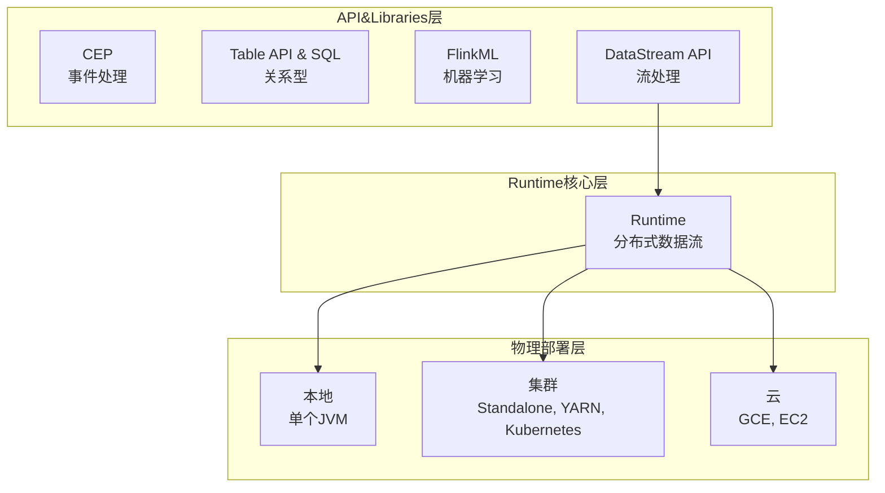

[toc]

# 第十二章 Flink

## 1.Flink简介

1. **项目基本信息**
    - **性质与定位**：Apache软件基金会顶级项目，是分布式、高性能、随时可用、准确的开源流处理框架，支持实时和批量计算 。
    - **起源与发展**：源于2010 - 2014年柏林工业大学、柏林洪堡大学和哈索普拉特纳研究所联合开展的Stratosphere项目。2014年4月代码贡献给Apache软件基金会成为孵化项目，同年12月成为顶级项目，是Apache软件基金会5大 大数据项目之一 。
    - **社区与应用**：全球有350多位开发人员，在国内被阿里巴巴、美团、滴滴等知名互联网企业大规模用作分布式大数据处理引擎 。
2. **功能特性**
    - **功能多样性**：能支持不同类型应用程序，具备批流一体化、精密状态管理、事件时间支持、精确一次的状态一致性保障等特性 。
    - **部署灵活性**：可在YARN、Mesos、Kubernetes等多种资源管理框架运行，也支持裸机集群独立部署，启用高可用选项可避免单点失效 。
    - **性能优势**：可扩展至数千核心，状态达TB级别时仍保持高吞吐、低延迟，被众多严苛流处理应用采用 。 

## 2.为什么选择Flink

### 2.1 传统数据处理架构
- **架构特点**：采用中心化数据库系统存储事务性数据，如ERP系统的供应链数据、订单系统的订单数据、CRM系统的客户数据等都存入该数据库 。

### 2.2 大数据Lambda架构
- **架构组成**：包含批处理层和实时处理层。批处理层用MapReduce、Spark等技术处理批量数据；实时处理层用Storm、Spark Streaming等技术处理实时数据 。

### 2.3 流处理架构
- **架构构成**：一般设消息传输层和流处理层。消息传输层采集数据源数据并传输给订阅应用；流处理层处理、聚合数据并维持应用状态 。
- **核心组件**：消息队列是核心，连接应用程序并作为共享数据源，取代大型集中式数据库。流处理器从消息队列订阅数据处理，处理后数据可流向其他消息队列或存入本地数据库 。
- **优势趋势**：逐步取代传统和Lambda架构。避免传统架构中数据库负载过重问题，将批处理视为流处理子集，用一个流处理框架统一处理流计算和批量计算，解决多框架管理难题 。

### 2.4 Flink是理想的流计算框架
- **流处理架构需求**：需低延迟、高吞吐和高性能 。
- **其他框架不足**：Storm能低延迟但无法高吞吐和准确处理故障时计算状态；Spark Streaming通过微批处理实现高吞吐和容错，但牺牲低延迟和实时处理能力 。
- **Flink优势**：实现Google Dataflow流计算模型，兼具高吞吐、低延迟和高性能，支持批处理和流处理，有高度容错的状态管理，防止状态丢失，满足流处理架构要求 。 

### 2.5 Flink的优势

1. 同时支持高吞吐、低延迟、高性能
2. 同时支持流处理和批处理
3. 高度灵活的流式窗口
4. 支持有状态计算
5. 具有良好的容错性
6. 具有独立的内存管理
7. 支持迭代和增量迭代

## 3.Flink应用场景

### 3.1 事件驱动型应用
- **什么是事件驱动型应用**
    - **定义**：一类具有状态的应用，从一个或多个事件数据流中读取事件，并依据到来事件做出反应，像触发计算、更新状态或执行其他外部动作等 。
    - **与传统应用区别**：传统应用设计中，计算和数据存储层相互独立，应用从远程事务数据库读写数据。而事件驱动型应用建立在有状态流处理基础上，数据和计算不分离，应用访问本地（内存或磁盘）获取数据，通过定期向远程持久化存储写入检查点实现容错 。
    - **典型应用**：反欺诈、异常检测、基于规则的报警、业务流程监控、Web应用（社交网络）等 。
- **事件驱动型应用的优势**
    - **性能优势**：访问本地数据，无需查询远程数据库，在吞吐量和延迟方面性能更优。向远程持久化存储写入检查点可异步、增量进行，对常规事件处理影响小 。
    - **协调优势**：传统分层架构中多个应用共享数据库，数据库变化时需谨慎协调。事件驱动型应用只关注自身数据，数据表示方式改变或应用升级时，协调工作量少 。
- **Flink是如何支持事件驱动型应用的**
    - **状态与时间处理**：Flink提供丰富状态操作原语，可管理TB级大量数据，保障“精确一次”一致性；支持事件时间、高度可定制窗口逻辑和细粒度时间控制，助于实现高级商业逻辑；拥有复杂事件处理（CEP）类库，用于检测数据流模式 。
    - **保存点特性**：“保存点”是一致性状态镜像，可作为诸多相互兼容应用的初始化点，方便应用升级、扩容及开展A/B测试 。

### 3.2 数据分析应用
- **什么是数据分析应用**
    - **传统分析**：从原始数据提取信息，先记录事件，再对有界数据集执行批量查询。要融入最新数据需添加到数据集并重新运行查询，结果写入存储系统或形成报表 。
    - **流式分析**：高级流处理引擎支持实时数据分析，获取实时事件流，连续产生和更新查询结果，结果存于外部数据库或作为内部状态维护，仪表盘应用可读取结果 。
    - **典型应用**：电信网络质量监控、移动应用产品更新及实验评估分析、消费者技术实时数据即席分析、大规模图分析等 。
- **流式分析应用的优势**
    - **延迟优势**：与批量分析相比，消除周期性导入和查询，获取洞察结果延迟更低，且无需处理输入数据人为边界 。
    - **架构优势**：流式分析应用架构更简单。批量分析流水线组件独立，需周期性调度数据提取和查询执行，组件失败影响整体；流式分析应用（如基于Flink）整合数据提取到结果计算步骤，依赖底层引擎故障恢复机制 。
- **Flink是如何支持数据分析应用的**
    - **接口与语义**：Flink同时支持批处理和流处理，提供符合ANSI规范SQL接口，为批处理和流处理提供一致语义，SQL查询在静态数据集和实时数据流上结果相同 。
    - **自定义功能**：提供丰富用户自定义函数，便于在SQL查询中执行自定义代码；DataStream API和DataSet API提供底层控制；Gelly库为基于批量数据集的大规模高性能图分析提供算法和构建模块支持 。

### 3.3 数据流水线应用 
- **什么是数据流水线**
    - **与ETL关系**：Extract-transform-load（ETL）是在存储系统间转换和移动数据的常用方法，ETL作业周期性触发，将事务型数据库数据复制到分析型数据库或数据仓库。数据流水线功能类似ETL，可转换、清洗数据或转移存储系统，但以连续流模式执行，非周期性触发 。
    - **工作示例**：数据源生成数据时，数据流水线读取并低延迟转移。如监控文件系统目录，新文件生成时读取内容写入事件日志；将事件流物化到数据库或增量构建、优化查询索引 。
    - **典型应用**：电子商务实时查询索引构建、电子商务持续ETL等 。
- **数据流水线的优势**
    - **延迟优势**：相较于周期性ETL作业，减少数据转移延迟 。
    - **功能优势**：能持续消费和发送数据，用途更广，支持更多用例 。 
- **Flink如何支持数据流水线应用**
    - **数据转换**：Flink的SQL接口（或Table API）及丰富用户自定义函数，可解决常见数据转换问题 。
    - **强大功能实现**：使用DataStream API可实现功能更强大的数据流水线 。
    - **连接与监控**：提供大量连接器，可连接Kafka、Kinesis、Elasticsearch、JDBC数据库等多种数据存储系统；提供面向文件系统的连续型数据源，监控目录变化，还提供数据槽（sink），支持按时间分区写入文件 。 

## 4.Flink技术栈

Flink发展越来越成熟，已经拥有了自己的丰富的核心组件栈。Flink核心组件栈分为三层：API&Libraries层、Runtime核心层和物理部署层。

## 5.Flink体系架构

Flink系统主要由两个组件组成，分别为JobManager和TaskManager，Flink 架构也遵循Master-Slave架构设计原则，JobManager为Master节点，TaskManager为Slave节点.

