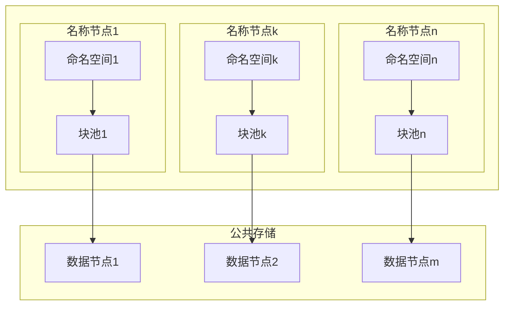
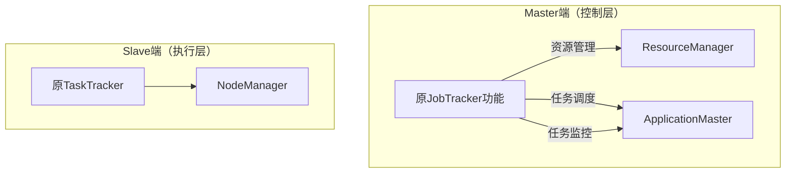
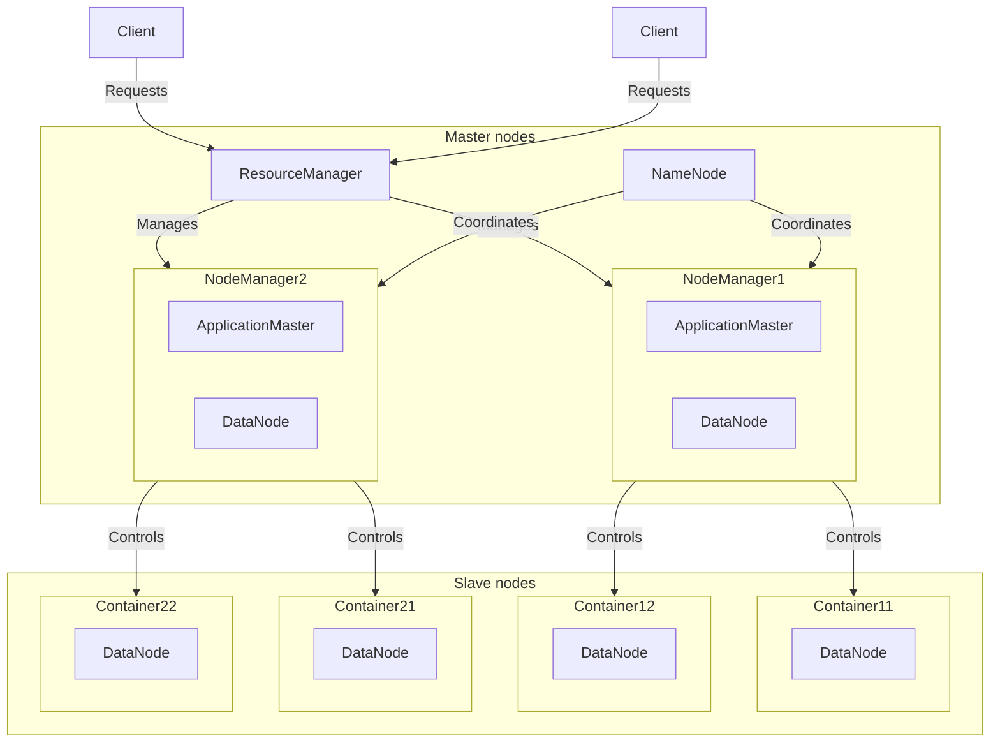
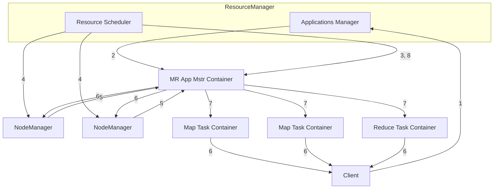

[toc]

# 第八章 Hadoop再探讨

# 1.Hadoop的优化与发展

## 1.1Hadoop的局限与不足
Hadoop1.0的核心组件（仅指MapReduce和HDFS，不包括Hadoop生态系统内的Pig、Hive、HBase等其他组件），主要存在以下不足：
* 抽象层次低，需人工编码
* 表达能力有限
* 开发者自已管理作业（Job）之间的依赖关系
* 难以看到程序整体逻辑
* 执行迭代操作效率低
* 资源浪费（Map和Reduce分两阶段执行)
* 实时性差（适合批处理，不支持实时交互式）
## 1.2针对Hadoop的改进与提升
Hadoop的优化与发展主要体现在两个方面：
* 一方面是Hadoop自身两大核心组件MapReduce和HDFS的架构设计改进。

| 组件        | Hadoop 1.0的问题   | Hadoop 2.0的改进                                    |
| --------- | --------------- | ------------------------------------------------ |
| HDFS      | 单一名称节点，存在单点失效问题 | 设计了HDFS HA，提供名称节点热备机制                            |
| HDFS      | 单一命名空间，无法实现资源隔离 | 设计了HDFS Federation，支持管理多个命名空间                    |
| MapReduce | 资源管理效率低         | 设计了新的资源管理框架YARN（Yet Another Resource Negotiator） |
* 另一方面是Hadoop生态系统其它组件的不断丰富，加入了Pig、Tez、Spark和 Kafka等新组件。

|组件|功能|解决Hadoop中存在的问题|
|---|---|---|
|Pig|处理大规模数据的脚本语言，用户编写简单语句即可自动转换为MapReduce作业|抽象层次低，需手工编写大量代码|
|Spark|基于内存的分布式并行编程框架，支持高实时性和迭代计算|MapReduce延迟高，不擅长迭代计算|
|Oozie|工作流引擎，协调Hadoop上不同任务的运行|原生缺乏作业间依赖关系管理机制，需手动处理依赖|
|Tez|支持DAG作业的计算框架，重组操作形成大DAG以减少冗余|MapReduce任务间存在重复操作（如重复读写HDFS），效率低下|
|Kafka|分布式消息系统，作为数据枢纽统一连接Hadoop组件|生态组件间缺乏高效统一的数据交换中介（如Flume与HDFS需定制对接）|

# 2.HDFS2.0新特性
## 2.1HDFS HA
### 1.HDFS 1.0 组件及功能回顾​

HDFS 1.0 的核心架构由 NameNode（名称节点） 和 DataNode（数据节点） 组成，各自承担不同的职责：

| 组件       | 功能                                          | 存储方式                                                      |
| -------- | ------------------------------------------- | --------------------------------------------------------- |
| NameNode | - 管理文件系统元数据（如文件目录结构、块映射关系）   - 处理客户端读写请求 | - 内存：实时元数据映射   - 磁盘：`FsImage`（元数据快照） + `EditLog`（操作日志） |
| DataNode | - 存储实际文件数据块   - 定期向NameNode汇报存储状态        | - 磁盘：数据块（默认3副本存储）                                         |

**​关键机制​**​  
• FsImage：文件系统元数据的完整快照（如文件路径、块列表），存储在磁盘，启动时加载到内存。
• EditLog：记录所有文件系统变更（如创建/删除文件），确保元数据实时更新。
• Secondary NameNode：定期合并`FsImage`和`EditLog`生成新检查点（`fsimage.cpt`），防止`EditLog`过大影响恢复效率。
### 2. HDFS 1.0 的单点故障问题​
HDFS 1.0 的核心缺陷是 NameNode 单点故障（SPOF），具体表现如下：

|问题点|影响|临时解决方案（Secondary NameNode）的局限|
|---|---|---|
|单NameNode架构|NameNode宕机导致整个集群不可用|Secondary NameNode 非热备份，无法自动接管故障节点|
|元数据恢复依赖磁盘文件|重启NameNode需加载`FsImage`并重放`EditLog`，海量操作日志导致恢复耗时极长|仅通过定期合并减少`EditLog`大小，无法解决实时高可用需求|
|内存元数据易丢失|内存中的元数据映射未持久化，故障后需重建|无实时元数据同步机制|

**​Secondary NameNode的局限性​**​  
* 角色误解：常被误认为备份节点，实际仅用于离线合并元数据。
* 手动切换：故障后需人工干预，无法实现秒级故障转移。
### 3. HDFS HA（高可用）解决方案​
HDFS 2.0 引入 HA架构，通过 主备NameNode 和 共享存储 彻底解决单点故障问题。

**​核心改进​**​

|机制|实现方式|优势|
|---|---|---|
|主备NameNode|- 主NameNode（Active）处理请求   - 备NameNode（Standby）实时同步元数据|故障时自动切换（秒级恢复）|
|共享存储（QJM）|使用 Quorum Journal Manager 集群同步`EditLog`，确保主备元数据一致性|避免依赖本地磁盘，防止脑裂问题|
|ZKFC（故障控制器）|通过ZooKeeper监控NameNode状态，触发主备切换|自动化故障检测与恢复|
|客户端透明重定向|客户端通过重试机制自动连接新Active NameNode|业务无感知中断|

**​HA架构关键流程​**​

1. 元数据同步：Active NameNode将`EditLog`写入共享JournalNode集群，Standby实时读取并更新内存元数据。
2. 故障检测：ZKFC监控心跳，超时后判定Active节点失效。
3. 切换触发：ZooKeeper选举新Active节点，并更新全局状态。
## 2.2HDFS Federation
### 1.HDFS1.0中存在的问题
* 单点故障问题
* 不可以水平扩展（是否可以通过纵向扩展来解决？）
* 系统整体性能受限于单个名称节点的吞吐量
* 单个名称节点难以提供不同程序之间的隔离性
* HDFSHA是热备份，提供高可用性，但是无法解决可扩展性、系统性能和隔离性

### 2.HDFS Federation的设计
* 在HDFS Federation中，设计了多个相互独立的名称节点，使得HDFS的命名服务能够水平扩展，这些名称节点分别进行各自命名空间和块的管理，相互之间是联盟（Federation）关系，不需要彼此协调。并且向后兼容。
* HDFSFederation中，所有名称节点会共享底层的数据节点存储数据资源，数据节点向所有名称节点汇报
* 属于同一个命名空间的块构成一个“块池”

### 3.HDFS Federation的访问模式
* 对于Federation中的多个命名空间，可以采用客户端挂载表（Client Side MountTable）方式进行数据共享和访问。
* 客户可以访问不同的挂载点来访问不同的子命名空间
* 把各个命名空间挂载到全局挂载表（mount-table）中，实现数据全局共享
* 同样的命名空间挂载到个人的挂载表中，就成为应用程序可见的命名空间
### 4.HDFSFederation相对于HDFS1.0的优势
HDFSFederation设计可解决单名称节点存在的以下几个问题：
（1）HDFS集群扩展性。多个名称节点各自分管一部分目录，使得一个集群可以扩展到更多节点，不再像HDFS1.0中那样由于内存的限制制约文件存储数目。
（2）性能更高效。多个名称节点管理不同的数据，且同时对外提供服务，将为用户提供更高的读写吞吐率。
（3）良好的隔离性。用户可根据需要将不同业务数据交由不同名称节点管理，这样不同业务之间影响很小。
需要注意的，HDFSFederation并不能解决单点故障问题，也就是说，每
个名称节点都存在在单点故障问题，需要为每个名称节点部署一个后备名
称节点，以应对名称节点挂掉对业务产生的影响
# 3.YARN
## 3.1MapReduce1.0的缺陷
1. 存在单点故障
2. JobTracker“大包大揽”导致任务过重（任务多时内存开销大，上限4000节点）
3. 容易出现内存溢出（分配资源只考虑MapReduce任务数，不考虑CPU、内存)
4. 资源划分不合理（强制划分为slot，包括Map slot和Reduce slot）
## 3.2YARN设计思路
YARN架构思路：将原JobTacker三大功能拆分

### 1.核心设计目标​
• 解耦资源管理与作业调度：

将 Hadoop 1.0 中 JobTracker 的职能拆分为：  
• 全局资源管理（ResourceManager）
• 应用级任务调度（ApplicationMaster）

### 2.架构分层​​

|组件|职责|
|---|---|
|ResourceManager|全局资源分配，管理所有 NodeManager 的资源（CPU、内存等）|
|NodeManager|单个节点上的资源执行者，向 RM 汇报资源状态，运行容器（Container）|
|ApplicationMaster|每个应用（如 MapReduce、Spark）独享的进程，负责任务调度和容错|

### 3.与 HDFS Federation 的对比​​

|维度|HDFS Federation|YARN|
|---|---|---|
|解决的问题|单一命名空间扩展性不足|单一 JobTracker 资源管理效率低|
|核心机制|客户端挂载表 + 多命名空间|资源调度与任务执行解耦|
|应用场景|数据存储与访问|计算资源管理与作业调度|

## 3.3YARN体系结构

| 组件                     | 角色                                     | 核心功能                                                                                                                                                 |
| ---------------------- | -------------------------------------- | ---------------------------------------------------------------------------------------------------------------------------------------------------- |
| ResourceManager (RM)   | 全局资源管理器，集群唯一（支持高可用主备切换）                | - 处理客户端请求：接收作业提交，分配首个Container（用于启动AM）   - 资源分配与调度：通过调度器（如Capacity/FairScheduler）全局协调资源分配   - 监控AM：跟踪AM状态，失败时重启   - 管理NM：接收NM心跳，监控节点健康与资源使用 |
| NodeManager (NM)       | 单个节点资源与任务管理者（每个从节点一个NM）                | - 节点资源管理：管理本地CPU、内存，定期向RM汇报   - 执行命令：处理RM指令（启停Container）和AM请求（创建/销毁Container）   - 隔离与监控：通过Cgroups隔离资源，监控Container运行状态                          |
| ApplicationMaster (AM) | 每个应用独享的进程（如MRAppMaster、Spark AM），由框架实现 | - 资源协商：向RM动态申请/释放Container资源   - 任务调度：拆分应用为任务（如Map/Reduce Task）并分配到Container   - 容错处理：监控任务，失败时重新申请资源执行   - 进度报告：向RM和客户端汇报应用状态与进度            |

## 3.4YARN工作流程
1. 用户编写客户端应用程序，向YARN提交应用程序，提交的内容包括ApplicationMaster程序、启动ApplicationMaster的命令、用户程序等
2. YARN中的ResourceManager负责接收和处理来自客户端的请求，为应用程序分配一个容器，在该容器中启动一个ApplicationMaster
3. ApplicationMaster被创建后会首先向ResourceManager注册
4. ApplicationMaster采用轮询的方式向ResourceManager申请资源
5. ResourceManager以“容器”的形式向提出申请的ApplicationMaster分配资源
6. 在容器中启动任务（运行环境、脚本）
7. 各个任务向ApplicationMaster汇报自己的状态和进度
8. 应用程序运行完成后，ApplicationMaster向ResourceManager的应用程序管理器注销并关闭自己

## 3.5YARN框架与MapReduce1.0框架的对比分析

| 对比维度    | MapReduce 1.0（Hadoop 1.0）                 | YARN（Hadoop 2.0+）                                             |
| ------- | ----------------------------------------- | ------------------------------------------------------------- |
| 框架角色    | 既是计算框架，又是资源管理调度框架（耦合设计）                   | 纯粹的资源调度管理框架（解耦设计），可运行多种计算框架（如MapReduce、Spark、Flink等）          |
| 客户端兼容性  | 客户端API与YARN保持兼容，旧代码无需修改即可在Hadoop 2.0+运行   | 继承MapReduce 1.0的客户端接口，兼容原有生态                                  |
| 资源管理单元  | 以Slot（槽位）为单位，分为Map Slot和Reduce Slot，静态划分  | 以Container（容器）为单位，动态分配资源（支持CPU、内存等）                           |
| 中心服务负载  | JobTracker同时负责资源调度和任务监控，负载高且易成为单点瓶颈       | ResourceManager仅负责全局资源调度，负载大幅降低；任务监控分散到各ApplicationMaster（AM） |
| 任务调度与监控 | 由JobTracker集中调度和监控所有任务                    | 由各作业的ApplicationMaster分布式管理任务调度和监控（如MapReduce作业的MRAppMaster）  |
| 多框架支持   | 仅支持MapReduce编程模型                          | 支持多计算框架，只需实现对应的AM（如Spark AM、Flink AM）                         |
| 资源利用率   | Slot静态分配导致资源利用率低（Map Slot空闲时Reduce任务无法使用） | Container动态申请，资源利用率高（按需分配）                                    |
| 扩展性与容错性 | JobTracker单点故障影响全局；扩展性差                   | ResourceManager支持高可用；AM故障后可由RM重新启动，扩展性更强                      |

## 3.6YARN的发展目标
**​YARN的目标：统一资源调度，实现“一个集群多个框架”​**​

**​1. 企业面临的挑战​**​  
在企业中，不同的业务场景需要使用多种计算框架，例如：  
• MapReduce：离线批处理

• Impala：实时交互式查询分析

• Storm：流式数据实时分析

• Spark：迭代计算

由于这些框架来自不同的开发团队，各自拥有独立的资源调度机制，企业通常采用 “一个框架一个集群” 的部署方式，即：  
• 为每个计算框架单独部署一套集群

• 不同集群之间资源隔离

**​2. 传统方式的问题​**​

|问题|具体表现|
|---|---|
|集群资源利用率低|每个集群独立运行，资源无法共享，导致部分集群空闲而其他集群资源紧张。|
|数据无法共享|不同集群的数据存储分离，数据集需要在集群间复制，增加存储和传输成本。|
|维护代价高|需要管理多个独立集群，运维复杂度高，升级和监控成本增加。|

**​3. YARN的解决方案​**​  
YARN 的目标是 “一个集群多个框架”，即：  
• 统一资源调度：在单个集群上部署 YARN，由 YARN 统一管理资源（CPU、内存等）。

• 多框架共存：在 YARN 上运行 MapReduce、Spark、Impala、Storm 等不同计算框架。

• 资源共享与弹性伸缩：根据各框架的负载需求，动态调整资源分配，提高利用率。

**​4. YARN的优势​**​

|优势|具体表现|
|---|---|
|提高集群利用率|不同应用混搭运行，避免资源浪费（如批处理+实时计算互补使用资源）。|
|数据共享|所有计算框架共享 HDFS 存储，避免数据跨集群移动。|
|降低运维成本|只需维护一个集群，减少管理复杂度。|
|弹性资源分配|根据业务优先级动态调整资源（如白天优先给交互式查询，夜间给批处理）。|
