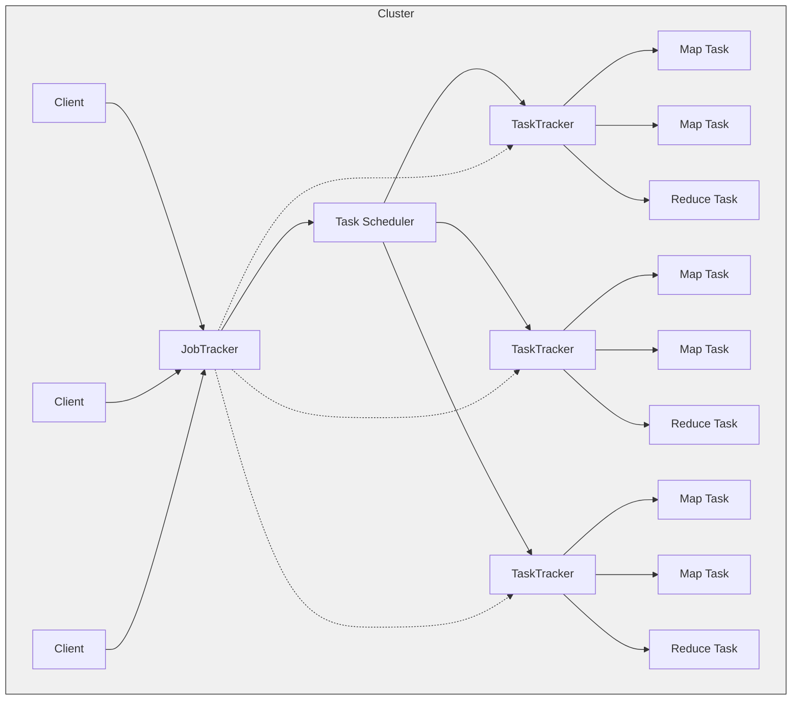
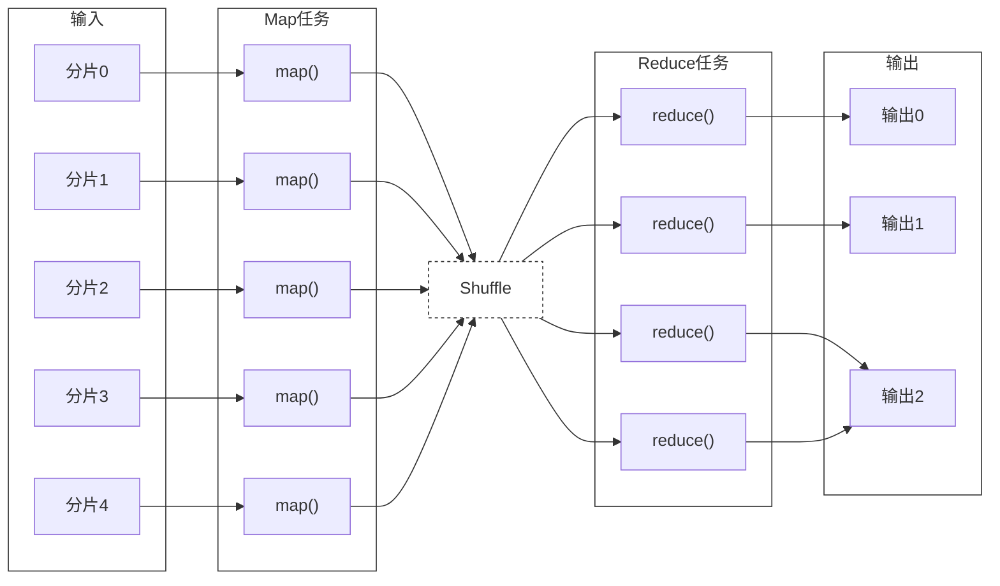
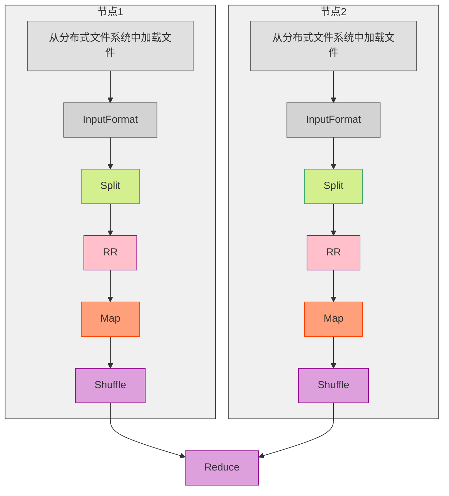
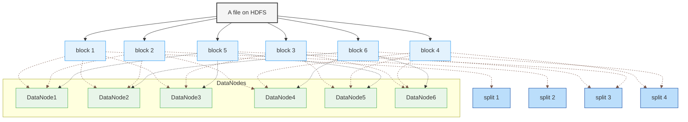
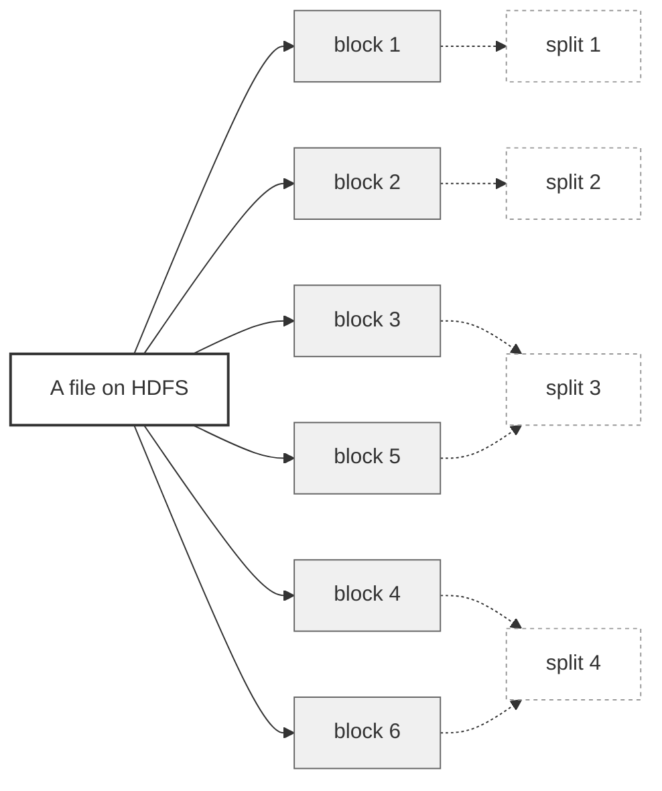
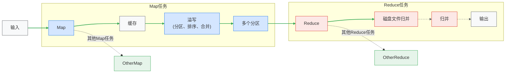
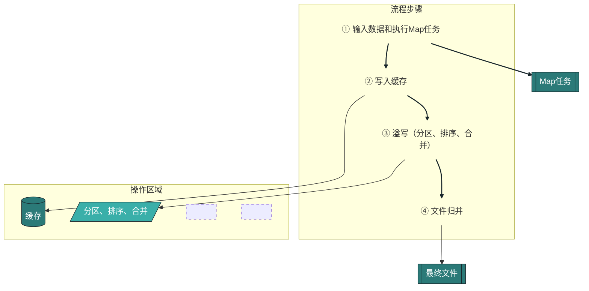
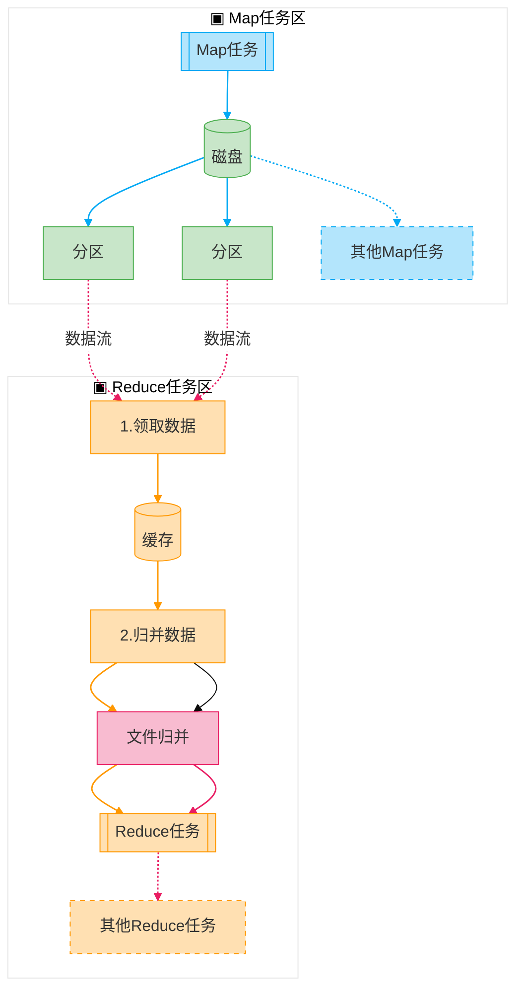

[toc]

# 第七章 MapReduce

# 1.概述

## 1.1分布式并行编程

| **对比维度**         | **传统并行计算框架**                          | **MapReduce**                              |
|----------------------|---------------------------------------------|--------------------------------------------|
| **集群架构/容错性**  | 共享式（共享内存/存储），容错性差             | 非共享式，容错性好                          |
| **硬件/价格/扩展**   | 刀片服务器、高速网、SAN，价格贵，扩展性差      | 普通PC机，便宜，扩展性好                     |
| **编程/学习难度**    | what-how（需关注实现细节），难度高            | what（仅需关注逻辑），简单                   |
| **适用场景**         | 实时、细粒度计算、计算密集型任务              | 批处理、非实时、数据密集型任务               |

## 1.2MapReduce模型简介
MapReduce将复杂的、运行于大规模集群上的并行计算过程高度地抽象到了两个函数：Map和Reduce。
这样做有什么好处呢？
1. 编程容易，不需要掌握分布式并行编程细节，也可以很容易把自己的程序运行在分布式系统上，完成海量数据的计算
2. MapReduce采用“分而治之”策略，一个存储在分布式文件系统中的大规模数据集，会被切分成许多独立的分片（split），这些分片可以被多个Map任务并行处理
3. MapReduce设计的一个理念就是“计算向数据靠拢”，而不是“数据向计算靠拢”，因为，移动数据需要大量的网络传输开销
4. MapReduce框架采用了Master/Slave架构，包括一个Master和若干个SlaveMaster上运行JobTracker，Slave上运行TaskTracker
5. Hadoop框架是用Java实现的，但是，MapReduce应用程序则不一定要用Java来写。
## 1.3Map和 Reduce函数
| **函数**     | **输入示例**                               | **输出示例**                          | **说明**                                                                              |
| ---------- | -------------------------------------- | --------------------------------- | ----------------------------------------------------------------------------------- |
| **Map**    | `<行号, "a b c">`                        | `List(<"a",1>, <"b",1>, <"c",1>)` | 1. 将小数据集解析成一批 `<key,value>` 对，输入Map函数处理。 2. 每个输入的 `<k1,v1>` 会输出一批中间结果 `<k2,v2>`。 |
| **Reduce** | `<"a", <1,1,1,1>>`（即 `<k2, List(v2)>`） | `<"a", 3>`（即 `<k3,v3>`）           | 输入的 `<k2, List(v2)>` 中，`List(v2)` 是同一 `k2` 的 value 集合，Reduce 对它们进行合并计算。             |
# 2.MapReduce体系结构
MapReduce体系结构主要由四个部分组成，分别是：Client、JobTracker、TaskTracker以及Task。

| 组件名称            | 核心功能描述              | 关键机制/特性                                                                               |
| --------------- | ------------------- | ------------------------------------------------------------------------------------- |
| **Client**      | 用户与MapReduce系统的交互接口 | - 提交MapReduce程序到JobTracker - 提供作业状态查询接口                                            |
| **JobTracker**  | 集群资源管理与作业调度中心       | - 监控所有TaskTracker和作业健康状态 - 任务失败时自动转移 - 资源使用跟踪与调度器协同（通过TaskScheduler分配空闲资源）      |
| **TaskTracker** | 节点资源管理与任务执行代理       | - 周期性通过"心跳"汇报资源/任务状态 - 使用Slot划分资源（Map Slot/Reduce Slot） - 执行JobTracker下发的任务启停指令 |
| **Task**        | 实际计算任务执行单元          | - **MapTask**：处理输入数据分片 - **ReduceTask**：执行聚合计算 - 均由TaskTracker动态启动              |

# 3.Map Reduce工作流程
## 3.1工作流程概述

* 不同的Map任务之间不会进行通信
* 不同的Reduce任务之间也不会发生任何信息交换
* 用户不能显式地从一台机器向另一台机器发送消息
* 所有的数据交换都是通过MapReduce框架自身去实现的
## 3.2MapReduce各个执行阶段

### 3.2.1关于Split(分片)

HDFS以固定大小的block为基本单位存储数据，而对于MapReduce而言，其处理单位是split。split是一个逻辑概念，它只包含一些元数据信息，比如数据起始位置、数据长度、数据所在节点等。它的划分方法完全由用户自己决定。
### 3.2.2Map任务的数量
Hadoop为每个split创建一个Map任务，split的多少决定了Map任务的数目。大多数情况下，理想的分片大小是一个HDFS块.

### 3.2.3Reduce任务的数量
* 最优的Reduce任务个数取决于集群中可用的reduce任务槽(slot)的数目
* 通常设置比reduce任务槽数目稍微小一些的Reduce任务个数（这样可以预留一些系统资源处理可能发生的错误）
## 3.3Shuffle过程详解
### 3.3.1Shuffle过程简介

### 3.3.2Map端Shuffle过程

1. 每个Map任务分配一个缓存MapReduce默认100MB缓存
2. 设置溢写比例0.8、分区默认采用哈希函数排序是默认的操作
3. 排序后可以合并（Combine）
4. 合并不能改变最终结果
5. 在Map任务全部结束之前进行归并
6. 归并得到一个大的文件，放在本地磁盘
7. 文件归并时，如果溢写文件数量大于预定值（默认是3）则可以再次启动Combiner，少于3不需要
8. JobTracker会一直监测Map任务的执行，并通知Reduce任务来领取数据

### 3.3.3Reduce端Shuffle过程

* Reduce任务通过RPC向JobTracker询问Map任务是否已经完成，若完成，则领取数据
* Reduce领取数据先放入缓存，来自不同Map机器，先归并，再合并，写入磁盘
* 多个溢写文件归并成一个或多个大文件，文件中的键值对是排序的
* 当数据很少时，不需要溢写到磁盘，直接在缓存中归并，然后输出给Reduce
