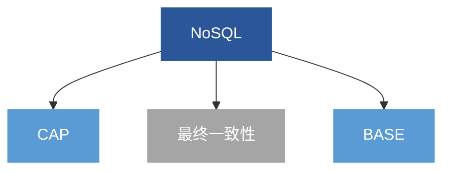
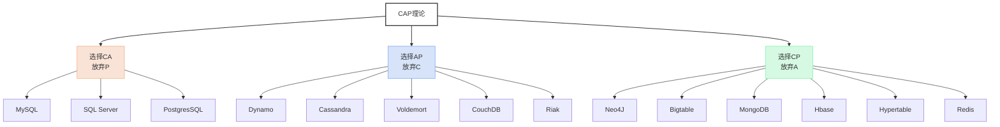

[toc]

# 第五章 NoSQL数据库

# 1.NoSQL 简介

最初表示反SQL”运动,现在表示关系和非关系型数据库各有优缺点用新型的非关系数据库取代关系数据库彼此都无法互相取代。
通常，NoSQL数据库具有以下几个特点：
（1）灵活的可扩展性
（2）灵活的数据模型
（3）与云计算紧密融合
# 2.NoSQL兴起的原因
**1关系数据库已经无法满足Web2.0的需求。**
1. 无法满足海量数据的管理需求
2. 无法满足数据高并发的需求
3. 无法满足高可扩展性和高可用性的需求
那么MySQL集群是否可以完全解决问题?
* **复杂性**：部署、管理、配置很复杂
* **数据库复制**：MySQL主备之间采用复制方式，只能是异步复制，当主库压力较大时可能产生较大延迟，主备切换可能会丢失最后一部分更新事务，这时往往需要人工介入，备份和恢复不方便。
* **扩容问题**：如果系统压力过大需要增加新的机器，这个过程涉及数据重新划分，整个过程比较复杂，且容易出错。
* **动态数据迁移问题**：如果某个数据库组压力过大，需要将其中部分数据迁移出去，迁移过程需要总控节点整体协调，以及数据库节点的配合。这个过程很难做到自动化。
 **2“One sizefits all”模式很难适用于截然不同的业务场景**
* 关系模型作为统一的数据模型既被用于数据分析，也被用于在线业务。但这两者一个强调高吞吐，一个强调低延时，已经演化出完全不同的架构。用同一套模型来抽象显然是不合适的.
* Hadoop就是针对数据分析\MongoDB、Redis等是针对在线业务，两者都抛弃了关系模型
**3关系数据库的关键特性包括完善的事务机制和高效的查询机制。但是，
关系数据库引以为傲的两个关键特性，到了Web2.0时代却成了鸡肋，主要
表现在以下几个方面**：
（1）Web2.0网站系统通常不要求严格的数据库事务
（2）Web2.0并不要求严格的读写实时性
（3）Web2.0通常不包含大量复杂的SQL查询（去结构化，存储空间换
取更好的查询性能)
# 3.NoSQL与关系数据库的比较

| **比较标准**       | **RDBMS**              | **NoSQL**               | **备注**                                                                 |
|--------------------|------------------------|-------------------------|--------------------------------------------------------------------------|
| **数据库原理**     | 完全支持               | 部分支持                | RDBMS基于关系代数理论；NoSQL缺乏统一理论基础                           |
| **数据规模**       | 大                     | 超大                    | RDBMS纵向扩展有限；NoSQL可通过添加设备横向扩展                         |
| **数据库模式**     | 固定                   | 灵活                    | RDBMS需严格定义模式；NoSQL可自由存储不同类型数据                       |
| **查询效率**       | 快（支持复杂查询）      | 快（简单查询）           | NoSQL复杂查询性能较差，缺乏索引支持；RDBMS通过索引优化查询             |
| **一致性**         | 强一致性（ACID）        | 弱一致性（BASE）         | NoSQL通常仅保证最终一致性                                              |
| **数据完整性**     | 容易实现（主键/外键）   | 很难实现                | RDBMS通过约束保证完整性；NoSQL缺乏机制支持                             |
| **扩展性**         | 一般（横向扩展难）       | 好（横向扩展易）         | NoSQL设计时已考虑横向扩展需求                                          |
| **可用性**         | 好                     | 很好                    | RDBMS优先保证一致性；NoSQL优先保证高可用性                            |
| **标准化**         | 是（SQL标准）          | 否                      | NoSQL无统一查询语言，接口难以规范化                                    |
| **技术支持**       | 高（成熟厂商支持）      | 低（起步阶段）           | NoSQL技术生态尚未成熟                                                  |
| **可维护性**       | 复杂（需DBA）          | 复杂                    | NoSQL虽比RDBMS简单，但仍需专业知识维护                                 |
（1）关系数据库
优势：以完善的关系代数理论作为基础，有严格的标准，支持事务ACID四性，借助索引机制可以实现高效的查询，技术成熟，有专业公司的技术支持
劣势：可扩展性较差，无法较好支持海量数据存储，数据模型过于死板、无法较好支持Web2.0应用，事务机制影响了系统的整体性能等
（2）NoSQL数据库
优势：可以支持超大规模数据存储，灵活的数据模型可以很好地支持Web2.0应用，具有强大的横向扩展能力等
劣势：缺乏数学理论基础，复杂查询性能不高，大都不能实现事务强一致性，很难实现数据完整性，技术尚不成熟，缺乏专业团队的技术支持，维护较困难等
# 4.NoSQL的四大类型
NoSQL数据库虽然数量众多，但是，归结起来，典型的NoSQL数据库通常包括键值数据库丶列族数据库、文档数据库和图形数据库。
## 4.1键值数据库

| **分类**         | **内容**                                                                                     |
|------------------|---------------------------------------------------------------------------------------------|
| **相关产品**     | Redis、Riak、SimpleDB、Chordless、Scalaris、Memcached                                        |
| **数据模型**     | - 键：字符串对象 - 值：任意类型（整型、数组、列表、集合等）                              |
| **典型应用**     | - 内容缓存（会话、配置文件、购物车等） - 移动应用（存储配置和用户数据）                  |
| **优点**         | - 扩展性好 - 灵活性高 - 大量写操作时性能优异                                           |
| **缺点**         | - 无法存储结构化信息 - 条件查询效率低 - **无法通过值查询**（仅支持键查询）             |
| **不适用情形**   | - 需通过值查询数据 - 需关联多个键（如数据关系） - 需事务支持（部分产品不支持回滚）    |
| **使用者案例**   | - 百度云数据库（Redis） - GitHub（Riak）、BestBuy（Riak/Redis/Memcached） - StackOverFlow（Redis） - YouTube/Wikipedia（Memcached） |

---
## 4.2列族数据库

| **分类**         | **内容**                                                                                     |
|------------------|---------------------------------------------------------------------------------------------|
| **相关产品**     | BigTable、HBase、Cassandra、HadoopDB、GreenPlum、NUTS                                       |
| **数据模型**     | 列族（Column Family） 分布式数据存储，支持地理上跨数据中心分布                          |
| **典型应用**     | - 容忍副本短期不一致的应用程序 - 动态字段的应用程序 - 超大规模数据（数百TB级）        |
| **优点**         | - 查找速度快 - 横向扩展性强 - 分布式部署简单 - 复杂性低                           |
| **缺点**         | - 功能较少（如不支持复杂事务） - 多数产品不保证强一致性（最终一致性为主）               |
| **不适用情形**   | - 需要ACID事务的场景（如银行系统） - 需要强一致性的实时业务                             |
| **使用者案例**   | - **Cassandra**：Ebay、Instagram、NASA、Twitter - **HBase**：Facebook、Yahoo!           |

---
## 4.3文档数据库

| **分类**         | **内容**                                                                                     |
|------------------|---------------------------------------------------------------------------------------------|
| **相关产品**     | MongoDB、CouchDB、Terrastore、ThruDB、RavenDB、SiSODB、RaptorDB、CloudKit、Perservere、Jackrabbit |
| **数据模型**     | - **键/值**结构 - **值（Value）**为版本化的文档 - 支持存储、索引和管理半结构化数据（如JSON/嵌套结构） |
| **典型应用**     | - 高并发读写场景（如网站后台） - 使用JSON数据结构的应用 - 非规范化数据存储（嵌套文档） |
| **优点**         | - **高性能**（高并发） - **灵活性高**（动态数据结构） - **复杂性低** - 支持嵌入式文档（减少关联查询） - 可基于键或内容构建索引 |
| **缺点**         | - **缺乏统一查询语法**（不同产品语法差异大） - **不支持跨文档事务** |
| **不适用情形**   | - 需要跨文档事务的场景（如金融交易） - 需要强SQL兼容性的应用 |
| **使用者案例**   | - **百度云数据库**（MongoDB） - **SAP**、Codecademy、Foursquare（MongoDB） - **NBC News**（RavenDB） |
## 4.4图数据库

| **分类**         | **内容**                                                                                     |
|------------------|---------------------------------------------------------------------------------------------|
| **相关产品**     | Neo4J、OrientDB、InfoGrid、Infinite Graph、GraphDB                                           |
| **数据模型**     | 图结构（节点、边、属性）                                                                     |
| **典型应用**     | - 社交网络关系分析 - 模式识别与依赖分析 - 推荐系统 - 路径寻找（如最短路径计算）      |
| **优点**         | - **灵活性极高**（动态关系建模） - **支持复杂图算法** - 直观表达现实世界复杂关系        |
| **缺点**         | - **实现复杂度高** - **数据规模受限**（超大规模图性能下降）                                |
| **不适用情形**   | - 简单键值或文档存储需求 - 需要大规模线性扩展的场景                                        |
| **使用者案例**   | - **Adobe**（Neo4J） - **Cisco**（Neo4J） - **T-Mobile**（Neo4J）                     |

---
## 4.5不同数据库对比
* **MySQL**产生年代较早，而且随着LAMP大潮得以成熟。尽管其没有什么大的改进，但是新兴的互联网使用的最多的数据库。
* **MongoDB**是个新生事物，提供更灵活的数据模型、异步提交、地理位置索引等五花十色的功能
* **HBase**是个“仗势欺人”的大象兵。依仗着Hadoop的生态环境，可以有很好的扩展性。但是就像象兵一样，使用者需要养一头大象(Hadoop)，才能驱使他。
* **Redis**是键值存储的代表，功能最简单。提供随机数据存储。就像一根棒子一样，没有多余的构造。
# 5.NoSQL的三大基石

## 5.1CAP
所谓的CAP指的是：
* **c（Consistency）：一致性**，是指任何一个读操作总是能够读到之前完成的写操作的结果，也就是在分布式环境中，多点的数据是一致的，或者说，所有节点在同一时间具有相同的数据.
* **A：（Availability）：可用性**，是指快速获取数据，可以在确定的时间内返回操作结果，保证每个请求不管成功或者失败都有响应。
* **P（Tolerance of NetworkPartition）：分区容忍性**，是指当出现网络分区的情况时（即系统中的一部分节点无法和其他节点进行通信），分离的系统也能够正常运行，也就是说，系统中任意信息的丢失或失败不会影响系统的操作。
CAP理论告诉我们，一个分布式系统不可能同时满足一致性、可用性和分区容忍性这三个需求，最多只能同时满足其中两个。

当处理CAP的问题时，可以有几个明显的选择：
1. **CA：也就是强调一致性（C）和可用性（A），放弃分区容忍性（P)**，最简单的做法是把所有与事务相关的内容都放到同一台机器上。很显然，这种做法会严重影响系统的可扩展性。传统的关系数据库（MySQL、SQLServer和PostgreSQL），都采用了这种设计原则，因此，扩展性都比较差。
2. **CP：也就是强调一致性（C）和分区容忍性（P），放弃可用性（A）**，当出现网络分区的情况时，受影响的服务需要等待数据一致，因此在等待期间就无法对外提供服务
3. **AP：也就是强调可用性（A）和分区容忍性（P），放弃一致性（C）**，允许系统返回不一致的数据。

## 5.2BASE
说起 BASE （Basically Availble, Soft-state, Eventual consistency，不得不谈到ACID。

| **ACID模型**        | **BASE模型**                   |
| ----------------- | ---------------------------- |
| 原子性 (Atomicity)   | 基本可用 (Basically Available)   |
| 一致性 (Consistency) | 软状态/柔性事务 (Soft state)        |
| 隔离性 (Isolation)   | 最终一致性 (Eventual consistency) |
| 持久性 (Durable)     |                              |

## 5.3最终一致性
**NoSQL的最终一致性（Eventual Consistency）** 是分布式数据库系统中的一种数据一致性模型，其核心特点是：**系统不保证数据的实时强一致性，但确保在没有新写入操作的情况下，经过一段时间后，所有节点最终会达成一致状态**。

---