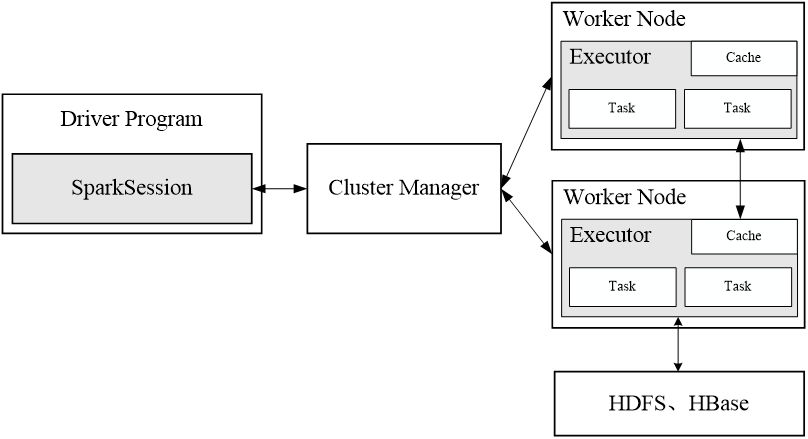
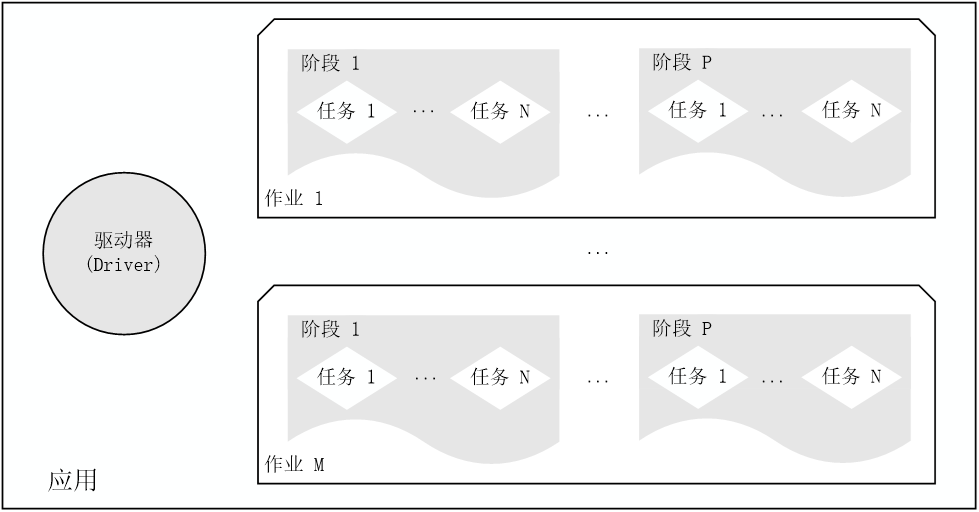
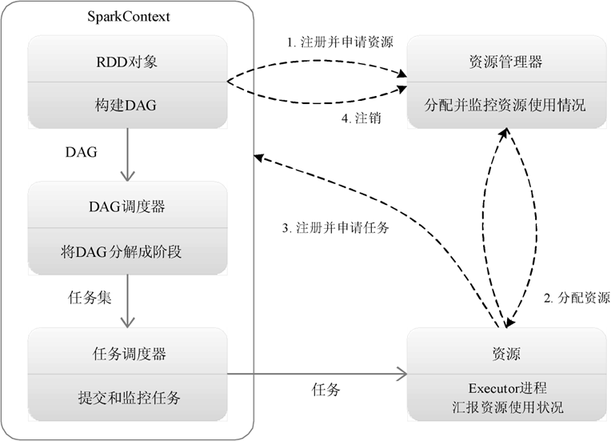

[toc]

# 第十章 Spark

# 1.Spark概述

## 1.1 Spark简介

Spark最初由美国加州伯克利大学（UCBerkeley）的AMP实验室于2009年开发，是基于内存计算的大数据并行计算框架，可用于构建大型的、低延迟的数据分析应用程序。

Spark具有如下几个主要特点：

| **特性**         | **描述**                                                     |
| ---------------- | ------------------------------------------------------------ |
| **运行速度快**   | 使用DAG执行引擎以支持循环数据流与内存计算                    |
| **容易使用**     | 支持Scala、Java、Python、R语言编程，可通过Spark Shell进行交互式编程 |
| **通用性**       | 提供完整技术栈：SQL查询、流式计算、机器学习、图算法组件      |
| **运行模式多样** | 支持独立集群模式、Hadoop、Amazon EC2等云环境，可访问HDFS、Cassandra、HBase、Hive等多种数据源 |

## 1.2 Scala简介

Scala是一门现代的多范式编程语言，运行于Java平台（JVM，Java 虚拟机），并兼容现有的Java程序。

Scala的特性：

| **特性**           | **描述**                                 |
| ------------------ | ---------------------------------------- |
| **强大的并发性**   | 支持函数式编程，能更好地开发分布式系统   |
| **语法简洁优雅**   | 代码简洁，能提供优雅的API                |
| **兼容Java**       | 运行于JVM，与Java无缝互操作，运行速度快  |
| **融合Hadoop生态** | 可集成到Hadoop生态圈（如Spark、Flink等） |

Scala是Spark的主要编程语言，但Spark还支持Java、Python、R。作为编程语言 Scala的优势是提供了REPL（Read-Eval-Print Loop，交互式解释器），提高程序开发效率。 

## 1.3 Spark与Hadoop的比较

| **对比维度**     | **Spark**                                                    | **Hadoop MapReduce**                                         |
| ---------------- | ------------------------------------------------------------ | ------------------------------------------------------------ |
| **计算模式**     | 基于 MapReduce，但支持更丰富的操作（如 filter、join、reduceByKey 等），编程模型更灵活 | 严格遵循 Map 和 Reduce 两阶段，表达能力有限                  |
| **执行效率**     | **内存计算**，中间结果缓存到内存，迭代运算效率高             | **依赖磁盘 I/O**，每次任务读写 HDFS，延迟高、开销大          |
| **任务调度机制** | **DAG（有向无环图）调度**，支持多阶段任务并行优化            | **线性执行**，前一个任务完成后才能启动下一个，任务衔接涉及额外 I/O 开销 |
| **适用场景**     | 适合迭代计算（机器学习）、实时分析、复杂多阶段任务           | 适合批处理、离线计算（如日志分析）                           |
| **延迟**         | 低延迟（内存计算）                                           | 高延迟（频繁磁盘读写）                                       |
| **API 灵活性**   | 支持 Scala/Java/Python/R，提供高阶函数（如 map、reduce、aggregate） | 仅支持 Map 和 Reduce 接口，开发复杂逻辑需额外代码            |
| **生态整合**     | 兼容 Hadoop 生态（HDFS、YARN），同时支持独立集群、云环境等   | 依赖 Hadoop 生态（HDFS+YARN）                                |

**关键结论**

1. **Spark 优势**：

    - **性能**：内存计算比 Hadoop 磁盘 I/O 快 10~100 倍（尤其迭代计算）。

    - **灵活性**：DAG 调度和多阶段任务优化更适合复杂场景。
    - **开发效率**：丰富的 API 和 REPL 交互式编程。

2. **Hadoop MapReduce 仍适用的场景**：

    - 超大规模**离线批处理**（如历史数据归档）。
    - 对**稳定性**要求极高且无需低延迟的任务。

# 2.Spark生态系统

## 2.1传统大数据处理方案的痛点

| **场景类型**             | **时间跨度**    | **代表技术**     | **存在的问题**                                               |
| ------------------------ | --------------- | ---------------- | ------------------------------------------------------------ |
| 复杂批量数据处理         | 数十分钟~数小时 | Hadoop MapReduce | 1. **数据孤岛**：不同系统间数据格式不兼容，需额外转换 2. **高维护成本**：多套系统需独立团队维护 3. **资源分配低效**：无法统一调度集群资源 |
| 基于历史数据的交互式查询 | 数十秒~数分钟   | Impala           |                                                              |
| 实时数据流处理           | 毫秒级~秒级     | Storm            |                                                              |

**核心问题**：多系统并行导致**复杂度高、效率低、成本高**。

## 2.2Spark的解决方案

**设计理念**

**“One Stack to Rule Them All”** —— 统一技术栈覆盖所有场景，解决传统方案的碎片化问题。

**核心优势**

| **对比维度** | **Spark方案**                                        | **传统方案**                           |
| ------------ | ---------------------------------------------------- | -------------------------------------- |
| **场景覆盖** | 批处理、交互查询、流计算、机器学习、图计算**一体化** | 需部署MapReduce/Impala/Storm等多套系统 |
| **执行效率** | 内存计算+DAG调度，比MapReduce快10~100倍              | 依赖磁盘I/O，延迟高                    |
| **开发维护** | 统一API（Scala/Java/Python/R），降低学习与协作成本   | 多语言、多系统，团队协作困难           |
| **资源管理** | 可集成YARN/Mesos，实现**跨任务资源动态分配**         | 静态资源划分，利用率低                 |

## 2.3Spark生态系统架构解析

**分层架构与组件**

1. **访问接口层（Access & Interfaces）**
    - **Spark SQL**：结构化数据查询（兼容Hive）
    - **Spark Streaming**：微批处理实时流计算
    - **GraphX**：图数据处理
    - **MLlib**：机器学习算法库
2. **处理引擎层（Processing Engine）**
    - **Spark Core**：统一分布式计算框架（内存管理、任务调度）
3. **存储层（Storage）**
    - **Tachyon**（现Alluxio）：内存加速存储
    - **HDFS/S3**：兼容主流分布式存储
4. **资源虚拟化层（Resource Virtualization）**
    - **YARN/Mesos**：与Hadoop生态无缝集成，支持动态资源调度

##  2.4Spark应用场景

| **应用场景**             | **时间跨度** | **其他框架**          | Spark生态系统中的组件                 |
| ------------------------ | ------------ | --------------------- | ------------------------------------- |
| 复杂的批量数据处理       | 小时级       | MapReduce、Hive       | Spark                                 |
| 基于历史数据的交互式查询 | 分钟级、秒级 | Impala、Dremel、Drill | Spark SQL                             |
| 基于实时数据流的数据处理 | 毫秒、秒级   | Storm、S4             | Spark Streaming  Structured Streaming |
| 基于历史数据的数据挖掘   | -            | Mahout                | MLlib                                 |
| 图结构数据的处理         | -            | Pregel、Hama          | GraphX                                |

# 3.Spark运行架构

## 3.1 基本概念

在具体讲解Spark运行架构之前，需要先了解以下7个重要的概念。

1. RDD：是分布式内存的一个抽象概念，提供了一种高度受限的共享内存模型。
2. DAG：反映RDD之间的依赖关系。
3. Executor：是运行在工作节点（Worker Node）上的一个进程，负责运行任务，并为应用程序存储数据。
4. 应用：用户编写的Spark应用程序。
5. 任务：运行在Executor上的工作单元。
6. 作业：一个作业（Job）包含多个RDD及作用于相应RDD上的各种操作。
7. 阶段：是作业的基本调度单位，一个作业会分为多组任务（Task），每组任务被称为“阶段”（Stage），或者也被称为“任务集”。

## 3.2 架构设计

Spark运行架构包括集群资源管理器（Cluster Manager）、运行作业任务的工作节点（Worker Node）、每个应用的驱动器（Driver Program，或简称为Driver）和每个工作节点上负责具体任务的执行器（Executor）。资源管理器可以自带或Mesos或YARN。

与Hadoop MapReduce计算框架相比，Spark所采用的Executor有两个优点：

1. 是利用多线程来执行具体的任务，减少任务的启动开销

2. 是Executor中有一个BlockManager存储模块，会将内存和磁盘共同作为存储设备，有效减少IO开销

Spark架构图

- 一个Application由一个Driver和若干个Job构成，一个Job由多个Stage构成，一个Stage由多个没有Shuffle关系的Task组成。

- 当执行一个Application时，Driver会向集群管理器申请资源，启动Executor，并向Executor发送应用程序代码和文件，然后在Executor上执行Task，运行结束后，执行结果会返回给Driver，或者写到HDFS或者其他数据库中

Spark中各概念相互间的关系：

## 3.3 Spark运行基本流程

1. 首先为应用构建起基本的运行环境，即由Driver创建一个SparkContext，进行资源的申请、任务的分配和监控
2. 资源管理器为Executor分配资源，并启动Executor进程
3. SparkContext根据RDD的依赖关系构建DAG图，DAG图提交给DAGScheduler解析成Stage，然后把一个个TaskSet提交给底层调度器TaskScheduler处理；Executor向SparkContext申请Task，Task Scheduler将Task发放给Executor运行，并提供应用程序代码
4. Task在Executor上运行，把执行结果反馈给TaskScheduler，然后反馈给DAGScheduler，运行完毕后写入数据并释放所有资源 。

Spark运行基本流程

总体而言，Spark运行架构具有以下特点：

1. 每个Application都有自己专属的Executor进程，并且该进程在Application运行期间一直驻留。Executor进程以多线程的方式运行Task

2. Spark运行过程与资源管理器无关，只要能够获取Executor进程并保持通信即可
3. Task采用了数据本地性和推测执行等优化机制

## 3.4 RDD的设计与运行原理

### 1.RDD设计背景

1. 许多迭代式算法（比如机器学习、图算法等）和交互式数据挖掘工具，共同之处是，不同计算阶段之间会重用中间结果

2. 目前的MapReduce框架都是把中间结果写入到HDFS中，带来了大量的数据复制、磁盘IO和序列化开销

3. RDD就是为了满足这种需求而出现的，它提供了一个抽象的数据架构，我们不必担心底层数据的分布式特性，只需将具体的应用逻辑表达为一系列转换处理，不同RDD之间的转换操作形成依赖关系，可以实现管道化，避免中间数据存储

### 2.RDD概念

#### RDD基本概念

1. 一个RDD就是一个分布式对象集合，本质上是一个只读的分区记录集合，每个RDD可分成多个分区，每个分区就是一个数据集片段，并且一个RDD的不同分区可以被保存到集群中不同的节点上，从而可以在集群中的不同节点上进行并行计算

2. RDD提供了一种高度受限的共享内存模型，即RDD是只读的记录分区的集合，不能直接修改，只能基于稳定的物理存储中的数据集创建RDD，或者通过在其他RDD上执行确定的转换操作（如map、join和group by）而创建得到新的RDD

#### RDD 与 分布式文件系统的核心区别

| **对比维度** | RDD（分布式共享内存集合）                            | **分布式文件系统（如HDFS）**               |
| ------------ | ---------------------------------------------------- | ------------------------------------------ |
| **设计目标** | 支持**高效分布式计算**，提供内存缓存、容错、并行操作 | 提供**高容错、高吞吐的持久化存储**         |
| **数据模型** | **分布式内存抽象**：数据分区存储在内存或磁盘         | **文件存储**：数据以文件/块形式存储在磁盘  |
| **数据特性** | 惰性计算、不可变（只读）、支持血缘（Lineage）容错    | 持久化存储、可修改、支持多用户并发访问     |
| **延迟**     | **毫秒~秒级**（内存优先）                            | **秒~分钟级**（依赖磁盘I/O）               |

#### RDD执行过程

1. RDD读入外部数据源（或者内存中的集合）进行创建。

2. RDD经过一系列的“转换”操作，每一次都会产生不同的RDD，供给下一个“转换”使用。

3. 最后一个RDD经“行动”操作进行处理，并输出到外部数据源（或者变成Scala集合或标量）。

#### 什么是血缘关系？什么是管道化？

在 **Spark RDD** 中，**血缘关系（Lineage）** 和 **管道化（Pipelining）** 是两个关键概念，它们共同优化了分布式计算的效率和容错性。以下是详细解析：

##### 1. 血缘关系（Lineage）

**定义**

RDD 的血缘关系是指 **RDD 的生成依赖链**，记录了从初始数据到当前 RDD 的所有转换操作（Transformations）的序列。

- 类似于“数据族谱”，通过记录每一步操作（如 `map`、`filter`、`join`），Spark 可以在任务失败时**重新计算丢失的分区**，而无需依赖数据副本。

**核心作用**

- **容错恢复**：如果某个 RDD 分区丢失，Spark 可根据血缘关系重新执行从源头开始的转换操作，恢复数据。
- **逻辑执行计划**：血缘关系是 Spark **惰性计算（Lazy Evaluation）** 的基础，只有触发 Action（如 `collect`、`save`）时才会真正执行计算。

##### 2. 管道化（Pipelining）

**定义**

管道化是指 **将多个连续的窄依赖（Narrow Dependency）转换操作合并为一个阶段（Stage）**，在单次任务中连续执行，避免中间结果的落盘。

- **窄依赖**：父 RDD 的每个分区最多被子 RDD 的一个分区依赖（如 `map`、`filter`）。
- **宽依赖**：父 RDD 的分区可能被子 RDD 的多个分区依赖（如 `groupByKey`、`join`），需要**跨节点数据混洗（Shuffle）**。

**核心作用**

- **减少 I/O 开销**：窄依赖操作（如 `map → filter`）无需将中间结果写入磁盘，直接在内存中传递数据。
- **提升性能**：通过合并操作减少任务调度和网络传输的开销。

##### 血缘关系 vs 管道化的联系与区别

| **维度**     | **血缘关系（Lineage）**      | **管道化（Pipelining）**   |
| ------------ | ---------------------------- | -------------------------- |
| **目的**     | 容错与逻辑依赖追踪           | 优化执行性能               |
| **触发条件** | 所有 RDD 转换操作均记录血缘  | 仅适用于连续的窄依赖操作   |
| **数据流动** | 记录操作序列，不涉及实际执行 | 实际合并操作，减少数据落地 |
| **依赖类型** | 适用于所有依赖（窄/宽）      | 仅适用于窄依赖             |

##### 总结

1. **血缘关系**是 Spark **容错机制的核心**，通过记录操作历史实现数据恢复。
2. **管道化**是 Spark **性能优化的关键**，通过合并窄依赖操作减少 I/O 和任务调度开销。
3. 两者协同工作：血缘关系确保正确性，管道化提升效率。

### 3.RDD特性

Spark采用RDD以后能够实现高效计算的原因主要在于：

1. 高效的容错性

​	现有容错机制：数据复制或者记录日志

​	RDD：血缘关系、重新计算丢失分区、无需回滚系统、重算过程在不同节点之间并行、只记录粗粒度的操作

2. 中间结果持久化到内存，数据在内存中的多个RDD操作之间进行传递，避免了不必要的读写磁盘开销

3. 存放的数据可以是Java对象，避免了不必要的对象序列化和反序列化

### 4.RDD之间的依赖关系

在 Spark 中，**宽依赖（Wide Dependency）** 和 **窄依赖（Narrow Dependency）** 是 RDD 依赖关系的两种类型，它们直接影响任务的**执行效率、容错机制和阶段（Stage）划分**。以下是详细解析：

#### 1. 宽依赖 vs 窄依赖的定义

##### 窄依赖（Narrow Dependency）

- **定义**：父 RDD 的**每个分区最多被一个子 RDD 分区依赖**。

- 特点

    - 数据无需跨节点传输（本地计算即可）。

    - 支持**管道化（Pipelining）**，多个操作可合并为一个 Stage。

        

##### 宽依赖（Wide Dependency）

- **定义**：父 RDD 的**每个分区可能被多个子 RDD 分区依赖**（需跨节点混洗数据）。
- 特点
    - 需要 **Shuffle**（数据重分布），性能开销大。
    - 是 **Stage 的划分边界**，必须等待前一个 Stage 完成。

#### 2.对 Stage 划分的影响

Spark 的 **DAG 调度器** 根据依赖关系将任务划分为多个 **Stage**：

- 窄依赖：操作可合并到同一个 Stage 中（管道化执行）。

- 宽依赖：强制生成新的 Stage，需等待前驱 Stage 完成并 Shuffle 数据。

### 5.阶段的划分

Spark 根据DAG 图中的RDD 依赖关系，把一个作业分成多个阶段。阶段划分的依据是窄依赖和宽依赖。对于宽依赖和窄依赖而言，窄依赖对于作业的优化很有利，宽依赖无法优化

逻辑上，每个RDD 操作都是一个fork/join（一种用于并行执行任务的框架），把计算fork 到每个RDD 分区，完成计算后对各个分区得到的结果进行join 操作，然后fork/join下一个RDD 操作。

### 6.RDD运行过程

通过上述对RDD概念、依赖关系和Stage划分的介绍，结合之前介绍的Spark运行基本流程，再总结一下RDD在Spark架构中的运行过程：

1. 创建RDD对象。

2. SparkContext负责计算RDD之间的依赖关系，构建DAG。

3. DAGScheduler负责把DAG分解成多个阶段，每个阶段中包含了多个任务，每个任务会被任务调度器分发给各个工作节点上的Executor去执行。
