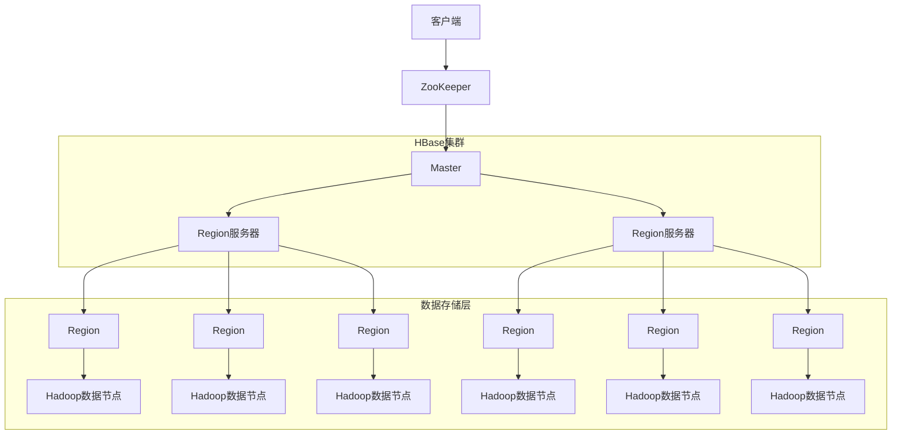
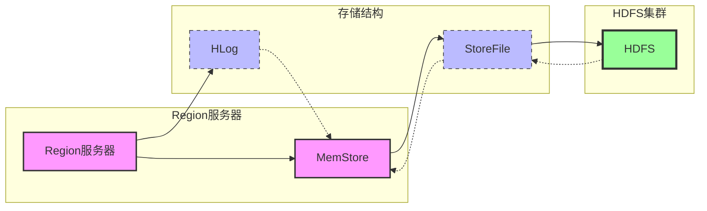
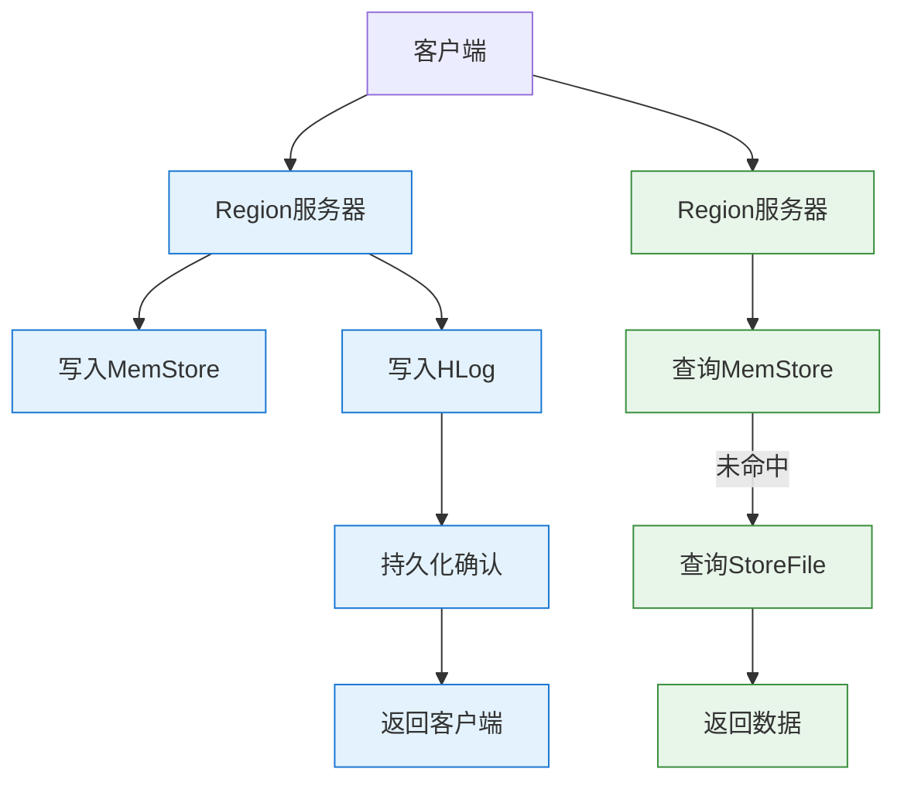
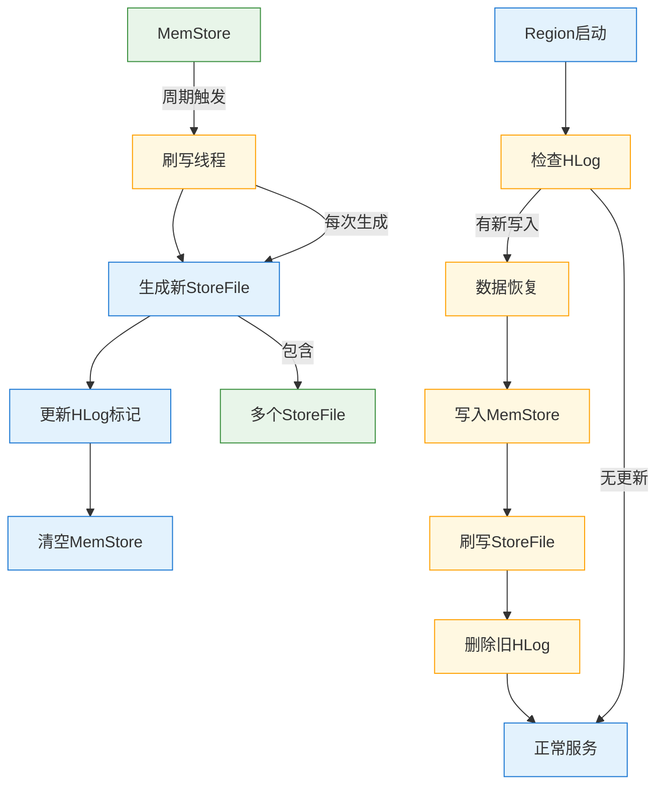
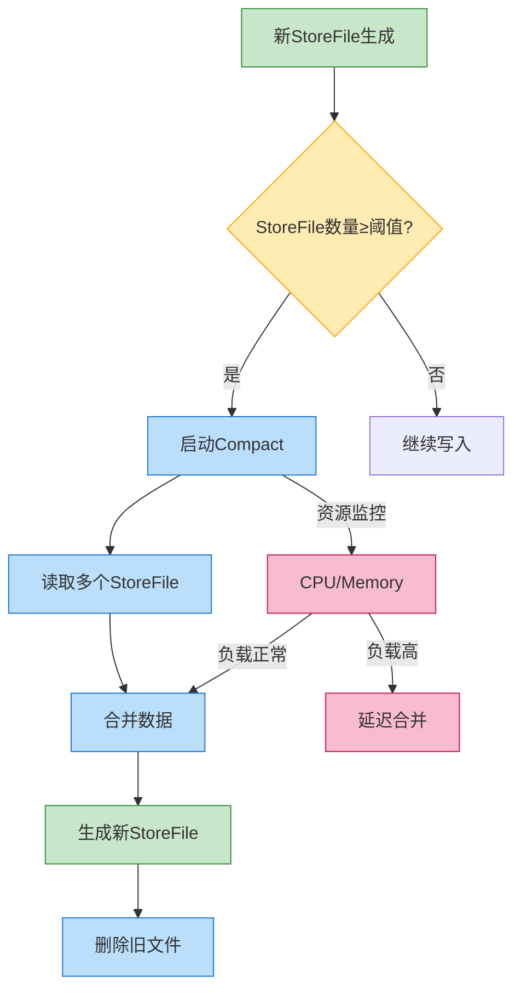
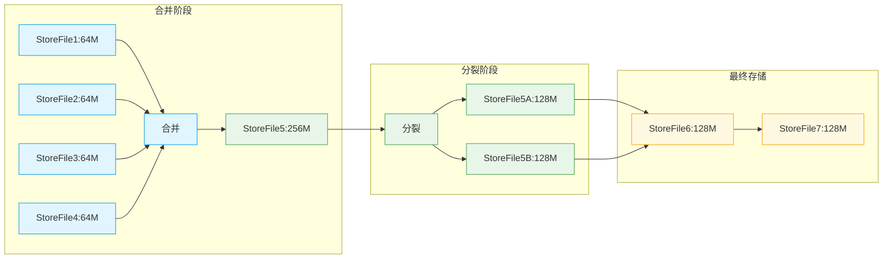
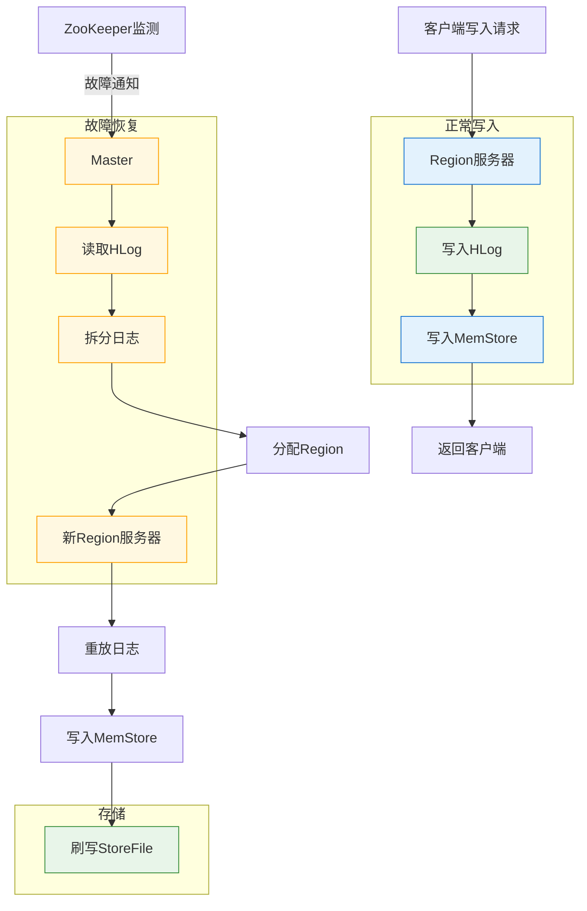

[toc]

# 第四章 分布式数据库Hbase

# 1.概述

## 1.1从BigTable 说起
BigTable是一个分布式存储系统，BigTable起初用于解决典型的互联网搜索问题。
* BigTable是一个分布式存储系统
* 利用谷歌提出的MapReduce分布式并行计算模型来处理海量数据
* 使用谷歌分布式文件系统GFS作为底层数据存储
* 采用Chubby提供协同服务管理
* 可以扩展到PB级别的数据和上千台机器，具备广泛应用性、可扩展性、高性能和高可用性等特点。
## 1.2HBase简介
HBase是一个高可靠、高性能、面向列、可伸缩的分布式数据库，是谷歌BigTable的开源实现，主要用来存储非结构化和半结构化的松散数据·HBase的目标是处理非常庞大的表，可以通过水平扩展的方式，利用廉价计算机集群处理由超过10亿行数据和数百万列元素组成的数据表。

| 对比项         | BigTable       | HBase               |
|----------------|----------------|---------------------|
| 文件存储系统   | GFS            | HDFS                |
| 海量数据处理   | MapReduce      | Hadoop MapReduce    |
| 协同服务管理   | Chubby         | Zookeeper           |
### 使用HBase的原因
关系数据库已经流行很多年，并且Hadoop已经有了HDFS和MapReduce，为什么需要HBase?
1. Hadoop可以很好地解决大规模数据的离线批量处理问题，但是受限于HadoopMapReduce编程框架的高延迟数据处理机制，使得Hadoop无法满足大规模数据实时处理应用的需求。
2. HDFS面向批量访问模式，不是随机访问模式
3. 传统的通用关系型数据库无法应对在数据规模剧增时导致的系统扩展性和性能问题（分库分表也不能很好解决）。
4. 传统关系数据库在数据结构变化时一般需要停机维护；空列浪费存储空间
因此，业界出现了一类面向半结构化数据存储和处理的高可扩展、低写入/查询延迟的系统，例如，键值数据库、文档数据库和列族数据库（如BigTable和HBase等)

## 1.3HBase与传统关系数据库的对比分析

| **对比项**  | **传统关系数据库**           | **HBase**              |
| -------- | --------------------- | ---------------------- |
| **数据类型** | 采用关系模型，支持丰富的数据类型和存储方式 | 采用简单模型，数据存储为未经解释的字符串   |
| **数据操作** | 支持复杂操作（如多表连接）         | 仅支持简单操作（插入、查询、删除、清空）   |
| **存储模式** | 基于行存储                 | 基于列存储，列族文件分离           |
| **数据索引** | 可针对不同列构建多个索引          | 仅通过行键索引（访问或扫描）         |
| **数据维护** | 更新时旧值被覆盖，不保留历史版本      | 更新时保留旧版本，生成新版本         |
| **可伸缩性** | 横向扩展困难，纵向扩展有限         | 支持水平扩展，可通过增减集群硬件实现性能伸缩 |


# 2.HBase访问接口

| **类型**          | **特点**                                      | **适用场合**                                  |
|--------------------|-----------------------------------------------|---------------------------------------------|
| Native Java API    | 最常规和高效的访问方式                          | 适合Hadoop MapReduce作业并行批处理HBase表数据 |
| HBase Shell        | HBase的命令行工具，最简单的接口                 | 适合HBase管理使用                            |
| Thrift Gateway     | 利用Thrift序列化技术，支持C++/PHP/Python等语言 | 适合异构系统在线访问HBase表数据               |
| REST Gateway       | 解除语言限制，支持REST风格HTTP API             | 跨语言环境访问HBase                          |
| Pig                | 使用Pig Latin流式编程语言处理数据              | 适合数据统计场景                             |
| Hive               | 接口简单                                      | 需要以类SQL方式访问HBase时                   |

# 3.HBase数据模型
## 3.1 数据模型概述
* HBase是一个稀疏、多维度、排序的映射表，这张表的索引是行键、列族、列限定符和时间戳。
* 每个值是一个未经解释的字符串，没有数据类型。
* 用户在表中存储数据，每一行都有一个可排序的行键和任意多的列表在水平方向由一个或者多个列族组成，一个列族中可以包含任意多个列，同一个列族里面的数据存储在一起。
* 列族支持动态扩展，可以很轻松地添加一个列族或列，无需预先定义列的数量以及类型，所有列均以字符串形式存储，用户需要自行进行数据类型转换。
* HBase中执行更新操作时，并不会删除数据旧的版本，而是生成一个新的版本，旧有的版本仍然保留（这是和HDFS只允许追加不允许修改的特性相关的）。
## 3.2 数据模型相关概念

| **概念**                     | **说明**         | **特点**                                                 |
| -------------------------- | -------------- | ------------------------------------------------------ |
| **表(Table)**               | HBase组织数据的基本单位 | 由行和列组成，列划分为多个列族                                        |
| **行(Row)**                 | 表的基本组成单元       | 每个行由唯一的**行键(Row Key)**标识（按字典序存储）                       |
| **列族(Column Family)**      | 列的逻辑分组         | • 访问控制的基本单元<br>• 物理存储单元（同列族数据存储在相同HDFS文件）              |
| **列限定符(Column Qualifier)** | 列族内的具体列定位标识    | 格式为`列族名:限定符`（如`info:name`）                             |
| **单元格(Cell)**              | 数据存储的最小单位      | • 由`行键+列族+列限定符+时间戳`唯一确定<br>• 数据始终以**字节数组(byte[])**形式存储 |
| **版本控制**                   | 每个单元格可存储多个版本数据 | 通过时间戳索引，默认保留3个版本（可配置）                                  |
## 3.3 数据坐标
HBase通过以下四个维度唯一确定一个单元格（Cell）：[行键(RowKey), 列族(ColumnFamily), 列限定符(ColumnQualifier), 时间戳]
**单元格版本示例**

| 行键       | 列族 | 列限定符 | 时间戳         | 值            |
|------------|------|----------|----------------|---------------|
| 201505003  | Info | email    | 1174184619081  | xiaqq.com     |
| 201505003  | Info | email    | 1174184620720  | you@163.com   |

**完整数据表示例**

| 行键       | 列族 | name     | major | email         |
|------------|------|----------|-------|---------------|
| 201505001  | Info | Luo Min  | Math  | luo@qq.com    |
| 201505002  | Info | Liu Jun  | Math  | liu@qq.com    |
| 201505003  | Info | Xie You  | Math  | xie@aa.com<br>you@163.com |

1. **行键(RowKey)**：数据行的唯一标识（如学号201505003）
2. **列族(ColumnFamily)**：列的物理分组（示例中只有`Info`列族）
3. **列限定符**：列族下的具体列（如name/email等）
4. **多版本存储**：相同坐标的单元格可通过时间戳存储多个版本（如email列的两个值）


## 3.4 概念视图

| 行键 | 时间戳 | 列族 contents                  | 列族 anchor                     |
|------|--------|--------------------------------|---------------------------------|
| t5   |        |                                | anchor:cnnsi.com="CNN"          |
| t4   |        |                                | anchor:my.look.ca="CNN.com"     |
| t3   |        | contents:html="<html>..."      |                                 |
| t2   |        | contents:html="<html>"         |                                 |
| t1   |        | contents:html="<html>..."      |                                 |

## 3.5 物理视图

| 行键          | 时间戳 | 列族contents               | 列族anchor                    |
|---------------|--------|----------------------------|-------------------------------|
| "com.cnwww"   | t3     | contents:html="<http让我>" |                               |
| "com.cnwww"   | t2     | contents:html="<http>..."  |                               |
| "com.cnwww"   | t1     | contents:html="<http>_"    |                               |
| "com.cnwww"   | t5     |                            | anchor:chnensi.com="CNN"      |
| "com.cnwww"   | t4     |                            | anchor:my.look.ca="CNN.com"   |

## 3.6 面向列的存储

| 行记录 | 列1 | 列2 | 列3 | ... |
|--------|-----|-----|-----|-----|
| r1     | 数据 | 数据 | 数据 | ... |
| r2     | 数据 | 数据 | 数据 | ... |
| r3     | 数据 | 数据 | 数据 | ... |
| r4     | 数据 | 数据 | 数据 | ... |
| r5     | 数据 | 数据 | 数据 | ... |

| 列族  | 行1  | 行2  | 行3  | 行4  | 行5  |
| --- | --- | --- | --- | --- | --- |
| 列1  | 数据  | 数据  | 数据  | 数据  | 数据  |
| 列2  | 数据  | 数据  | 数据  | 数据  | 数据  |
| 列3  | 数据  | 数据  | 数据  | 数据  | 数据  |
| ... | ... | ... | ... | ... | ... |

# 4.HBase实现原理
## 4.1 HBase功能组件
HBase的实现包括三个主要的功能组件：
（1）库函数：链接到每个客户端
（2）一个Master主服务器
（3）许多个Region服务器

主服务器Master负责管理和维护HBase表的分区信息，维护Region服务器列表，分配Region，负载均衡。

Region服务器负责存储和维护分配给自己的Region，处理来自客户端的读写请求。

客户端并不是直接从Master主服务器上读取数据，而是在获得Region的存储位置信息后，直接从Region服务器上读取数据。

客户端并不依赖Master，而是通过Zookeeper来获得Region位置信息，大多数客户端甚至从来不和Master通信，这种设计方式使得Master负担很小。
## 4.2 表和 Region

### 表(Table)的核心特性
1. **​逻辑结构​**​：
   - 由无限扩展的行组成（每行通过RowKey唯一标识）
   - 列族(Column Family)是表的物理存储单元
   - 支持动态列（通过列限定符扩展）
2. **​物理存储​**​：
   Table -> Regions -> Stores -> HFiles
   (表)    (分区)    (列族存储) (实际文件)
3. **Region分裂机制​**​：
	- 初始状态：表创建时只有一个Region
	- 触发条件：当Region大小超过阈值（默认10GB）
	- 分裂过程：按照RowKey范围拆分为两个子Region


## 4.3 Region的定位
* 元数据表，又名.META.表，存储了Region和Region服务器的映射关系
* 当HBase表很大时，.META.表也会被分裂成多个Region
* 根数据表，又名-ROOT-表，记录所有元数据的具体位置
* -ROOT-表只有唯一一个Region，名字是在程序中被写死的
* Zookeeper文件记录了-ROOT-表的位置

HBase三级寻址架构表格：

| 层次     | 名称           | 作用                                                                 |
|----------|----------------|----------------------------------------------------------------------|
| 第一层   | Zookeeper文件  | 记录了-ROOT-表的位置信息                                            |
| 第二层   | -ROOT-表       | 1. 记录了.META.表的Region位置信息<br>2. 只能有一个Region<br>3. 通过-ROOT-表可以访问.META.表中的数据 |
| 第三层   | .META.表       | 1. 记录了用户数据表的Region位置信息<br>2. 可以有多个Region<br>3. 保存了HBase中所有用户数据表的Region位置信息 |
以下是基于图片信息的HBase三层寻址架构Region容量计算整理：

### HBase三层寻址架构Region容量计算

1. 核心假设条件

| 参数                | 数值       | 说明                          |
|---------------------|------------|-----------------------------|
| 单个Region最大容量   | 128MB      | 包括-ROOT-/.META./用户数据表 |
| 单行记录内存占用     | 1KB        | 每个映射条目的内存消耗        |

 2. 分层容量计算

| 层级      | 计算式                       | 结果容量       | 说明                           |
| ------- | ------------------------- | ---------- | ---------------------------- |
| -ROOT-表 | 128MB ÷ 1KB               | 2¹⁷个Region | 最多寻址2¹⁷个.META.Region         |
| .META.表 | 128MB ÷ 1KB               | 2¹⁷个Region | 每个.META.Region可寻址2¹⁷用户Region |
| **总容量** | (128MB/1KB) × (128MB/1KB) | 2³⁴个Region | 理论最大寻址能力                     |

3. **架构特性**：
   ```mermaid
   graph LR
       A[Client] --> B[Zookeeper]
       B --> C[-ROOT-表]
       C --> D[.META.表]
       D --> E[用户数据表Region]
   ```

### 客户端访问数据时的"三级寻址"
为了加速寻址，客户端会缓存位置信息，同时，需要解决缓存失效问题
寻址过程客户端只需要询问Zookeeper服务器，不需要连接Master服务器
# 5.HBase运行机制
## 5.1 HBase系统架构

---
1. 客户端
客户端包含访问HBase的接口，同时在缓存中维护着已经访问过的region位置信息，用来加快后续数据访问过程
2. Zookeeper服务器
Zookeeper可以帮助选举出一个Master作为集群的总管，并保证在任何时刻总有唯一一个Master在运行，这就避免了Master的“单点失效“问题
Zookeeper是一个很好的集群管理工具，被大量用于分布式计算，提供配置维护、域名服务、分布式同步、组服务等。
3. Master
	主服务器Master主要负责表和Region的管理工作：
	* 管理用户对表的增加、删除、修改、查询等操作
	* 实现不同Region服务器之间的负载均衡
	* 在Region分裂或合并后，负责重新调整Region的分布
	* 对发生故障失效的Region服务器上的Region进行迁移
4. Region服务器
Region服务器是HBase中最核心的模块，负责维护分配给自己的Region，并响应用户的读写请求
## 5.2 Region服务器工作原理


### 1.用户读写数据过程
* 用户写入数据时，被分配到相应Region服务器去执行
* 用户数据首先被写入到MemStore和Hlog中
* 只有当操作写入Hlog之后，commit0调用才会将其返回给客户端
* 当用户读取数据时，Region服务器会首先访问MemStore缓存，如果找不到，再去磁盘上面的StoreFile中寻找

### 2. 缓存的刷新
* 系统会周期性地把MemStore缓存里的内容刷写到磁盘的StoreFile文件中，清空缓存，并在Hlog里面写入一个标记
* 每次刷写都生成一个新的StoreFile文件，因此，每个Store包含多个StoreFile文件
* 每个Region服务器都有一个自己的HLog文件，每次启动都检查该文件，确认最近一次执行缓存刷新操作之后是否发生新的写入操作；如果发现更新，则先写入MemStore，再刷写到StoreFile，最后删除旧的Hlog文件，开始为用户提供服务。

### 3. StoreFile的合并
* 每次刷写都生成一个新的StoreFile，数量太多，影响查找速度
* 调用Store.compact0把多个合并成一个
* 合并操作比较耗费资源，只有数量达到一个阈值才启动合并

---
## 5.3 Store工作原理
Store是Region服务器的核心:
* 多个StoreFile合并成一个
* 单个StoreFile过大时，又触发分裂操作，1个父Region被分裂成两个子Region.

## 5.4 HLog工作原理
分布式环境必须要考虑系统出错。HBase采用HLog保证系统恢复。
HBase系统为每个Region服务器配置了一个HLog文件，它是一种预写式日志（WriteAhead Log），用户更新数据必须首先写入日志后，才能写入MemStore缓存，并且，直到MemStore缓存内容对应的日志已经写入磁盘，该缓存内容才能被刷写到磁盘。

* Zookeeper会实时监测每个Region服务器的状态，当某个Region服务器发生故障时，Zookeeper会通知Master。
* Master首先会处理该故障Region服务器上面遗留的HLog文件，这个遗留的HLog文件中包含了来自多个Region对象的日志记录系统会根据每条日志记录所属的Region对象对HLog数据进行拆分，分别放到相应Region对象的目录下，然后，再将失效的Region重新分配到可用的Region服务器中，并把与该Region对象相关的。
* HLog日志记录也发送给相应的Region服务器Region服务器领取到分配给自己的Region对象以及与之相关的HLog日志记录以后，会重新做一遍日志记录中的各种操作，把日志
* 记录中的数据写入到MemStore缓存中，然后，刷新到磁盘的StoreFile文件中，完成数据恢复。
共用日志优点：提高对表的写操作性能；缺点：恢复时需要分拆日志

---
