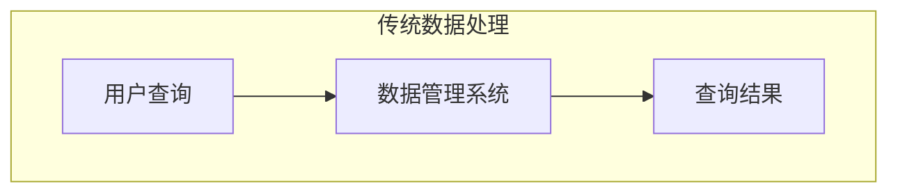
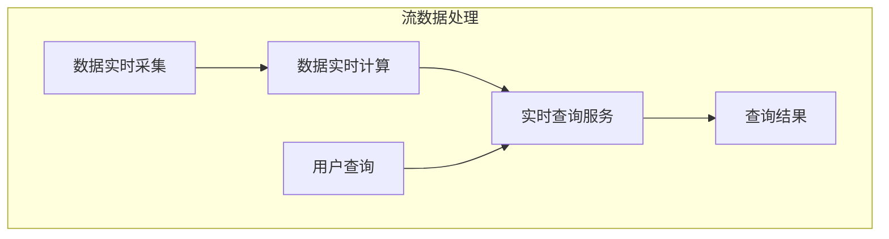

[toc]

# 第十一章 流计算

## 1 流计算概述

### 1.1 静态数据和流数据

近年来，在Web应用、网络监控、传感监测等领域，兴起了一种新的数据密集型应用——流数据，即数据以大量、快速、时变的流形式持续到达

流数据具有如下特征：

- 数据快速持续到达，潜在大小也许是无穷无尽的

- 数据来源众多，格式复杂

- 数据量大，但是不十分关注存储，一旦经过处理，要么被丢弃，要么被归档存储

- 注重数据的整体价值，不过分关注个别数据

- 数据顺序颠倒，或者不完整，系统无法控制将要处理的新到达的数据元素的顺序

### 1.2 批量计算和实时计算

对静态数据和流数据的处理，对应着两种截然不同的计算模式：批量计算和实时计算

| **对比维度**       | **批量计算**                            | **流计算**                                     |
| ------------------ | --------------------------------------- | ---------------------------------------------- |
| **数据类型**       | 静态数据（如历史数据、批量文件）        | 流数据（实时动态数据，如日志、传感器数据）     |
| **处理时机**       | 充裕时间处理（非实时，可批量调度）      | 实时处理（数据产生即处理，低延迟）             |
| **响应时间**       | 分钟级、小时级或更长                    | 秒级或毫秒级                                   |
| **数据量适应性**   | 适合大规模静态数据（如TB/PB级历史数据） | 适合持续增长的实时数据流（数据量可动态扩展）   |
| **数据一致性**     | 强一致性（批量处理保证事务性）          | 最终一致性（流式处理可能存在乱序或延迟）       |
| **系统设计核心**   | 吞吐量优先（关注批量处理效率）          | 低延迟优先（关注实时响应能力）                 |
| **数据时效性要求** | 低（处理历史数据，时效性要求不高）      | 高（数据价值随时间衰减，需立即处理）           |
| **典型问题场景**   | 大数据离线分析、数据仓库构建            | 实时欺诈检测、物联网设备监控、实时用户行为分析 |

### 1.3 流计算概念

流计算(**数据的价值随着时间的流逝而降低**)：实时获取来自不同数据源的海量数据，经过实时分析处理，获得有价值的信息。

对于一个流计算系统来说，它应达到如下需求：

- 高性能：处理大数据的基本要求，如每秒处理几十万条数据

- 海量式：支持TB级甚至是PB级的数据规模
- 实时性：保证较低的延迟时间，达到秒级别，甚至是毫秒级别
- 分布式：支持大数据的基本架构，必须能够平滑扩展
- 易用性：能够快速进行开发和部署
- 可靠性：能可靠地处理流数据

### 1.4 流计算与Hadoop

| **对比项**         | **Hadoop（MapReduce）批量处理特点**                          | **流计算需求特点**     | **Hadoop处理流计算存在的问题**                               |
| ------------------ | ------------------------------------------------------------ | ---------------------- | ------------------------------------------------------------ |
| **设计初衷**       | 面向大规模数据的批量处理，每台机器并行运行MapReduce任务，最后汇总输出 | 处理持续到达的动态数据 | 设计初衷并非处理动态数据                                     |
| **处理方式**       | 专门面向静态数据的批量处理，内部机制高度优化批处理           | 实时处理动态数据流     | 不适合处理持续到达的动态数据                                 |
| **变通方案及问题** | 将批量处理转为小批量处理，把输入数据切成小片段，每隔周期启动MapReduce作业 | -                      | 1. 切分片段增加附加开销，需处理片段依赖关系 2. 需改造MapReduce以支持流式处理 |
| **结论**           | 擅长批处理                                                   | -                      | 不适合流计算                                                 |

## 2 流计算处理流程

### 2.1 概述

| **对比项**         | **传统数据处理流程**                         | **流数据处理流程**             |
| ------------------ | -------------------------------------------- | ------------------------------ |
| **数据采集与存储** | 先采集数据并存储在关系数据库等数据管理系统中 | 数据实时采集                   |
| **数据计算时机**   | 无专门实时计算阶段，依赖查询触发             | 数据实时计算                   |
| **查询特性**       | 用户主动发出查询获取结果，数据可能不具时效性 | 提供实时查询服务，数据时效性强 |
| **数据状态**       | 处理静态、旧数据                             | 处理动态、实时数据             |

#### 传统数据处理流程

#### 流数据处理流程

### 2.2 数据实时采集

#### 数据实时采集要点

1. **采集要求**：数据实时采集阶段需采集多个数据源海量数据，要保证实时性、低延迟与稳定可靠。
2. **场景举例**：以日志数据为例，因分布式集群广泛应用，数据分散在不同机器，需实时汇总。
3. **开源工具**：许多互联网公司发布开源分布式日志采集系统可满足每秒数百MB数据采集传输需求，如：
    - Facebook的Scribe
    - LinkedIn的Kafka
    - 淘宝的Time Tunnel
    - 基于Hadoop的Chukwa和Flume 

#### 数据采集系统基本架构

1. **Agent**：主动采集数据，并将数据推送到Collector部分 。
2. **Collector**：接收多个Agent的数据，实现有序、可靠、高性能的转发 。 
3. **Store**：存储Collector转发过来的数据（流计算场景下不存储数据） 。 

### 2.3 数据实时计算

- 数据实时计算阶段对采集的数据进行实时的分析和计算，并反馈实时结果

- 经流处理系统处理后的数据，可视情况进行存储，以便之后再进行分析计算。在时效性要求较高的场景中，处理之后的数据也可以直接丢弃

### 2.4 实时查询服务

1. **定义与功能**
实时查询服务指流计算框架得出的结果可供用户实时查询、展示或储存。
2. **与传统数据处理对比**
    - **查询主动性**：传统数据处理流程需用户主动发出查询才能获取结果；流处理流程中，实时查询服务可不断更新结果，并将用户所需结果实时推送给用户 。
    - **数据时效性**：传统数据处理系统即使通过定时查询更新结果和推送，得到的仍是基于过去某时刻数据的结果；流处理系统处理的是实时数据，用户获取的是实时结果 。
3. **流处理系统与传统数据处理系统差异**
   
    - **处理数据类型**：流处理系统处理实时数据；传统数据处理系统处理预先存储的静态数据 。
    - **结果时效性**：流处理系统提供实时结果；传统数据处理系统提供过去某时刻结果 。 
    - **查询交互方式**：流处理系统无需用户主动查询，主动推送实时结果；传统数据处理系统需用户主动查询。
    
     

## 3 流计算应用

1. **应用场景广泛**：流计算用于对流数据进行实时计算，可应用于Web服务、机器翻译、广告投放、自然语言处理、气候模拟预测等多种场景 。
2. **互联网行业实例**：在百度、淘宝等大型网站，每天产生大量流数据（如用户搜索内容、浏览记录）。利用流计算进行实时数据分析，能掌握流量变化，分析用户实时浏览轨迹，实现实时个性化内容推荐 。 
3. **适用场景特征**：并非所有场景都需流计算，流计算适用于处理持续到达的流数据，且对数据处理实时性要求较高的场景 。 

## 4 Storm

1. **地位与优势**
Storm是流计算引擎先驱，如同Hadoop在批处理中的地位。能简单、高效、可靠处理流数据，支持多种编程语言，其框架便于与数据库系统整合开发强大实时计算系统。
2. **缺陷与现状**
存在明显缺陷，不支持有状态计算和“精确一次”语义，吞吐量有限。Flink流计算框架出现并大规模推广后，Storm活跃度下降，在与Flink市场竞争中渐处下风，预计未来将彻底退出历史舞台。 

## 5 Spark Streaming

1. **基本原理**
将实时输入数据流按秒级时间片拆分，再由Spark引擎以类似批处理方式处理每个时间片数据 。
2. **核心抽象 - 离散化数据流（DStream）**
    - **概念**：表示连续数据流。
    - **内部实现**：输入数据按时间片（如1秒）划分为DStream，每段数据转为Spark中的RDD，对DStream操作最终变为对相应RDD的操作。例如单词统计时，每个时间片存储句子的RDD经flatMap操作，生成存储单词的RDD，后续可根据业务需求处理中间结果或存储到外部设备 。 

## 6 Structured Streaming

### 6.1 Structured Streaming简介
- **定义与特性**：基于Spark SQL引擎构建，是可扩展且容错的流处理引擎。通过统一API，让用户能像编写批处理程序一样编写流处理程序，降低使用难度。
- **设计目标**：实现端到端的完全一致性。为此设计输入源、执行引擎和接收器，借助检查点和预写日志跟踪处理进度，应对故障；若接收器“幂等”，通过重放等操作确保一致性 。
- **性能提升**：从Spark 2.3.0起引入持续流式处理模型，将流处理延迟降至毫秒级。 

### 6.2 Structured Streaming的关键思想
- **数据模型**：把实时数据流看作不断添加数据的表，流计算类似在静态表上进行批处理查询。Spark在无界输入表上运行计算并增量查询，输入流数据添加到无界表形成新表 。

### 6.3 Structured Streaming的两种处理模型
- **微批处理**
    - **执行方式**：默认处理模型，Spark流计算引擎定期检查流数据源，对新到达数据执行批量查询。Driver将待处理数据偏移量存预写日志设检查点，保障重新启动或恢复查询 。
    - **延迟情况**：为保证确定性重新执行和端到端语义，当前数据需等前批作业完成且偏移量记入日志后处理，导致数据处理延迟超100ms 。
- **持续处理**
    - **适用场景**：针对对延迟要求极高场景，如金融行业信用卡欺诈交易识别，需10 - 20ms内处理每笔交易 。
    - **执行方式**：Spark 2.3.0引入试验性功能，不再依触发器周期启动任务，而是通过连续读取、处理和写入结果的长时间运行任务处理数据。引入新算法设检查点，特殊标记记录注入输入数据流，任务遇标记异步报告偏移量给引擎写入预写日志 。
    - **延迟与一致性**：可将延迟缩至毫秒级，但因写入异步，故障时数据流可能被处理多次，只能保证“至少一次”一致性 。 

## 7 Flink

- **项目地位与特性**：Flink是Apache软件基金会顶级项目，是开源流处理架构，具备分布式、高性能、随时可用和准确的特点，可同时支持实时计算和批量计算 。
- **市场竞争优势**：在流计算领域优势显著，使Storm、Spark Streaming、Structured Streaming等其他流计算框架相形见绌。Spark社区因Flink竞争压力推出Structured Streaming ，但Flink作为天然流计算框架，在流计算性能上远超天然批处理框架Spark，在与Spark Streaming、Structured Streaming竞争中占上风，也让先驱Storm陷入生存困境 。 